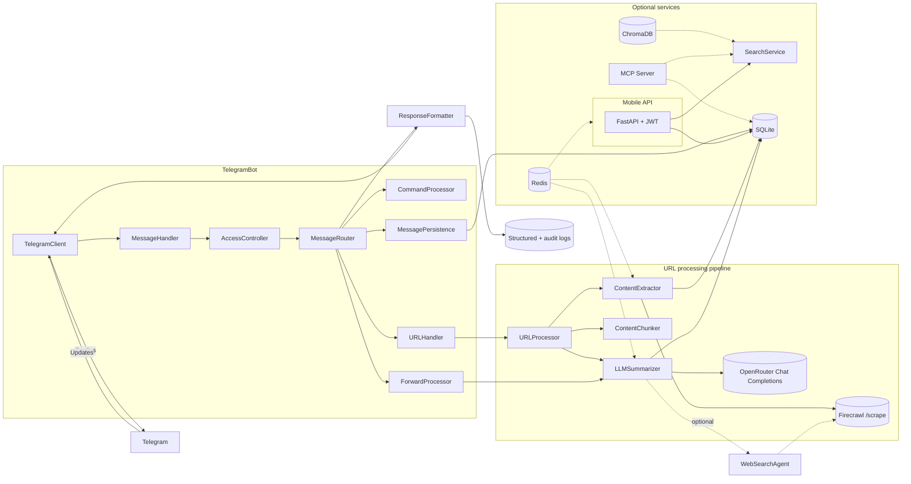

# Bite-Size Reader

Async Telegram bot that summarizes web articles and YouTube videos. For articles, it uses Firecrawl + OpenRouter; for YouTube videos, it downloads the video (1080p) and extracts transcripts. Also supports summarizing forwarded channel posts. Returns a strict JSON summary and stores artifacts in SQLite. See SPEC.md for full details.

## Architecture overview



The bot ingests updates via a lightweight `TelegramClient`, normalizes them through `MessageHandler`, and hands them to `MessageRouter`. The router enforces access control, persists interaction metadata, and dispatches requests either to the command processor, the URL handler (which orchestrates Firecrawl + OpenRouter summarization through `URLProcessor`), or the forward processor for channel reposts. `ResponseFormatter` centralizes Telegram replies and audit logging while all artifacts land in SQLite.

## Quick start

- Copy `.env.example` to `.env` and fill required secrets.
- Build and run with Docker.
- See `docs/DEPLOYMENT.md` for full setup, deployment, and update instructions.

## Docker

- If you updated dependencies in `pyproject.toml`, generate lock files first: `make lock-uv` (or `make lock-piptools`).
- Build: `docker build -t bite-size-reader .`
- Run: `docker run --env-file .env -v $(pwd)/data:/data --name bsr bite-size-reader`

## Commands and usage

You can simply send a URL (or several URLs) or forward a channel post -- commands are optional.

### Summarization

| Command | Description |
|---------|-------------|
| `/help`, `/start` | Show help and usage |
| `/summarize <URL>` | Summarize a URL immediately |
| `/summarize` | Bot asks for a URL in the next message |
| `/summarize_all <URLs>` | Summarize multiple URLs without confirmation |
| `/cancel` | Cancel pending summarize prompt or multi-link confirmation |

Multiple URLs in one message: bot asks "Process N links?"; reply "yes/no". Each link gets its own correlation ID and is processed sequentially.

### Content Management

| Command | Description |
|---------|-------------|
| `/unread [limit] [topic]` | Show unread articles, optionally filtered by topic |
| `/read <request_id>` | Mark an article as read |

### Search

| Command | Description |
|---------|-------------|
| `/search <query>` | Search summaries by keyword |
| `/find`, `/findweb`, `/findonline` | Search using Firecrawl web search |
| `/finddb`, `/findlocal` | Search local database only |

### Admin

| Command | Description |
|---------|-------------|
| `/dbinfo` | Show database statistics |
| `/dbverify` | Verify database integrity |

### Integrations

| Command | Description |
|---------|-------------|
| `/sync_karakeep` | Trigger Karakeep bookmark sync |

## Environment

### Required

```bash
API_ID=...                 # Telegram API ID
API_HASH=...               # Telegram API hash
BOT_TOKEN=...              # Telegram bot token
ALLOWED_USER_IDS=123456789 # Comma-separated owner IDs
FIRECRAWL_API_KEY=...      # Firecrawl API key
OPENROUTER_API_KEY=...     # OpenRouter API key
OPENROUTER_MODEL=deepseek/deepseek-v3.2
```

### Optional subsystems

| Subsystem | Key variables |
|-----------|--------------|
| YouTube | `YOUTUBE_DOWNLOAD_ENABLED=true`, `YOUTUBE_PREFERRED_QUALITY=1080p`, `YOUTUBE_STORAGE_PATH=/data/videos` |
| Web Search | `WEB_SEARCH_ENABLED=false`, `WEB_SEARCH_MAX_QUERIES=3` |
| Redis | `REDIS_ENABLED=true`, `REDIS_URL` or `REDIS_HOST`/`REDIS_PORT` |
| ChromaDB | `CHROMA_HOST=http://localhost:8000`, `CHROMA_AUTH_TOKEN` |
| MCP Server | `MCP_ENABLED=false`, `MCP_TRANSPORT=stdio`, `MCP_PORT=8200` |
| Mobile API | `JWT_SECRET_KEY`, `ALLOWED_CLIENT_IDS`, `API_RATE_LIMIT_*` |
| Karakeep | `KARAKEEP_ENABLED=false`, `KARAKEEP_API_URL`, `KARAKEEP_API_KEY` |
| Runtime | `DB_PATH=/data/app.db`, `LOG_LEVEL=INFO`, `DEBUG_PAYLOADS=0`, `MAX_CONCURRENT_CALLS=4` |

Full reference: `docs/environment_variables.md`

## Repository layout

```
app/
  adapters/
    content/     -- Firecrawl integration, content chunking, LLM summarization, web search context
    youtube/     -- YouTube video download and transcript extraction
    external/    -- Response formatting helpers shared by adapters
    karakeep/    -- Karakeep bookmark sync
    llm/         -- Provider-agnostic LLM abstraction
    openrouter/  -- OpenRouter client, payload shaping, error handling
    telegram/    -- Telegram client, message routing, access control, persistence, command_handlers/
  agents/        -- Multi-agent system (extraction, summarization, validation, web search)
  api/           -- Mobile API (FastAPI, JWT auth, sync endpoints)
    models/      -- Pydantic request/response models
    routers/     -- Route handlers (auth, summaries, sync, collections, health, system)
    services/    -- API business logic
  application/   -- Application layer (DTOs, use cases)
  cli/           -- CLI tools (summary runner, search, MCP server, migrations, Chroma backfill)
  config/        -- Configuration modules
  core/          -- URL normalization, JSON contract, logging, language helpers
  db/            -- SQLite schema, migrations, audit logging helpers
  di/            -- Dependency injection
  domain/        -- Domain models and services (DDD patterns)
  grpc/          -- gRPC service definitions
  handlers/      -- Request handlers
  infrastructure/ -- Persistence layer, event bus, vector store
    cache/       -- Cache layer (Redis)
    clients/     -- HTTP client wrappers
    messaging/   -- Messaging infrastructure
  mcp/           -- MCP server for AI agent access
  models/        -- Pydantic-style models (Telegram entities, LLM config)
  observability/ -- Metrics, tracing, telemetry
  prompts/       -- LLM prompt templates (en/ru, including web search analysis)
  security/      -- Security utilities
  services/      -- Topic search, embedding, hybrid search services
  types/         -- Type definitions
  utils/         -- Validation and helper utilities
bot.py           -- Entrypoint wiring config, DB, and Telegram bot
SPEC.md          -- Full technical specification
```

## YouTube video support

The bot automatically detects YouTube URLs and processes them differently from regular web articles.

**Supported URL formats:** Standard watch, short (`youtu.be`), shorts, live, embed, mobile (`m.youtube.com`), YouTube Music, legacy `/v/`.

**Processing workflow:**
1. Extract video ID from URL (handles query parameters in any order)
2. Extract transcript via `youtube-transcript-api` (prefers manual, falls back to auto-generated)
3. Download video in configured quality (default 1080p) via `yt-dlp`
4. Download subtitles, metadata (JSON), and thumbnail
5. Generate summary from transcript using LLM
6. Store video metadata, file paths, and transcript in database

**Storage management:** Videos stored in `/data/videos`, auto-cleanup of old videos, size limits per-video and total, deduplication via URL hash.

**Requirements:** `ffmpeg` (included in Docker image), `yt-dlp`, `youtube-transcript-api`.

## Web search enrichment (optional)

When `WEB_SEARCH_ENABLED=true`, the bot enriches article summaries with current web context:

1. LLM analyzes content to identify knowledge gaps (unfamiliar entities, recent events, claims needing verification)
2. If search would help, LLM extracts targeted search queries (max 3)
3. Firecrawl Search API retrieves relevant web results
4. Search context is injected into the summarization prompt
5. Final summary benefits from up-to-date information beyond LLM training cutoff

Only ~30-40% of articles trigger search (self-contained content is skipped). Adds 1 extra LLM call for analysis plus 1-3 Firecrawl search calls when triggered. Feature is opt-in to control costs.

## Mobile API

FastAPI-based REST API for mobile clients with Telegram-based JWT authentication, summary retrieval, and sync endpoints. See `docs/MOBILE_API_SPEC.md` for details.

## MCP Server

Model Context Protocol server that exposes articles and search to external AI agents (OpenClaw, Claude Desktop). Provides 12 tools and 10 resources for searching, retrieving, and exploring stored summaries. See `docs/mcp_server.md`.

## Redis caching

Optional caching layer for Firecrawl and LLM responses, API rate limiting, sync locks, and background task distributed locking. Degrades gracefully when unavailable. Set `REDIS_ENABLED=true`.

## Karakeep integration

Syncs bookmarks from Karakeep (self-hosted bookmark manager) into the summarization pipeline. Use `/sync_karakeep` to trigger manually or enable `KARAKEEP_AUTO_SYNC_ENABLED=true` for periodic sync.

## Local CLI summary runner

- With the same environment variables exported (Firecrawl + OpenRouter keys, DB path, etc.), run `python -m app.cli.summary --url https://example.com/article`.
- Pass full message text instead of `--url` to mimic Telegram input, e.g. `python -m app.cli.summary "/summary https://example.com"`.
- The CLI loads environment variables from `.env` in your current directory (or project root) automatically; override with `--env-file path/to/.env` if needed.
- Add `--accept-multiple` to auto-confirm when multiple URLs are supplied, `--json-path summary.json` to write the final JSON to disk, and `--log-level DEBUG` for verbose traces.
- The CLI generates stub Telegram credentials automatically, so no real bot token is required for local runs.

## Errors and correlation IDs

All user-visible errors include `Error ID: <cid>` to correlate with logs and DB `requests.correlation_id`.

## Dev tooling

- Install dev deps: `pip install -r requirements.txt -r requirements-dev.txt`
- Format: `make format` (ruff format + isort)
- Lint: `make lint` (ruff)
- Type-check: `make type` (mypy)
- Pre-commit: `pre-commit install` then commits will auto-run hooks
- Optional: `pip install loguru` to enable Loguru-based JSON logging with stdlib bridging

## Pre-commit hooks

Hooks run in this order to minimize churn: Ruff (check with `--fix`, format), isort (profile=black), mypy, plus standard hooks. If a first run modifies files, stage the changes and run again.

## Local environment

- Create venv: `make venv` (or run `scripts/create_venv.sh`)
- Activate: `source .venv/bin/activate`
- Install deps: `pip install -r requirements.txt -r requirements-dev.txt`

## Dependency management

- Source of truth: `pyproject.toml` ([project] deps + [project.optional-dependencies].dev).
- Locked requirements are generated to `requirements.txt` and `requirements-dev.txt`.
- With uv (recommended):
  - Install: `curl -Ls https://astral.sh/uv/install.sh | sh`
  - Lock: `make lock-uv`
- With pip-tools:
  - `python -m pip install pip-tools`
  - Lock: `make lock-piptools`
- Regenerate locks after changing dependencies in `pyproject.toml`.

## CI

GitHub Actions workflow `.github/workflows/ci.yml` enforces:
- Lockfile freshness (rebuilds from `pyproject.toml` and checks diff)
- Lint (ruff), format check (ruff format, isort), type check (mypy)
- Unit tests with coverage (pytest, 80% threshold)
- Docker image build on every push/PR; optional push to GHCR when `PUBLISH_DOCKER` repository variable is set to `true` (non-PR events)
- OpenAPI spec validation, code complexity (radon)
- Codecov coverage reporting
- Integration tests
- Security checks: Bandit (SAST), pip-audit + Safety (dependency vulns)
- Secrets scanning: Gitleaks on workspace and full history (history only on push)
- PR summary automation

## Docker publishing (optional)

- Enable publishing to GitHub Container Registry (GHCR):
  - In repository settings -> Variables, add `PUBLISH_DOCKER=true`.
  - Ensure workflow permissions include `packages: write` (already configured).
  - Images are tagged as:
    - `ghcr.io/<owner>/<repo>:latest` (on main)
    - `ghcr.io/<owner>/<repo>:<git-sha>`

## Automated lockfile PRs

- Workflow `.github/workflows/update-locks.yml` watches `pyproject.toml` and opens a PR to refresh `requirements*.txt` using uv.
- Auto-merge is enabled for that PR; once CI passes, GitHub will automatically merge it.
- You can also trigger it manually from the Actions tab.

## Documentation

| Document | Description |
|----------|-------------|
| `SPEC.md` | Full technical specification (canonical reference) |
| `CLAUDE.md` | AI assistant guide for the codebase |
| `docs/DEPLOYMENT.md` | Setup and deployment guide |
| `docs/environment_variables.md` | Complete environment variable reference |
| `docs/mcp_server.md` | MCP server tools, resources, and configuration |
| `docs/claude_code_hooks.md` | Claude Code safety hooks |
| `docs/multi_agent_architecture.md` | Multi-agent system design |
| `docs/MOBILE_API_SPEC.md` | Mobile API specification |
| `docs/HEXAGONAL_ARCHITECTURE_QUICKSTART.md` | Architecture patterns guide |

## Notes

- Dependencies include Pyrogram; if using PyroTGFork, align installation accordingly.
- Bot commands are registered on startup for private chats.
- Python 3.13+ required for all dependencies including scikit-learn for text processing and optional uvloop for async performance.
