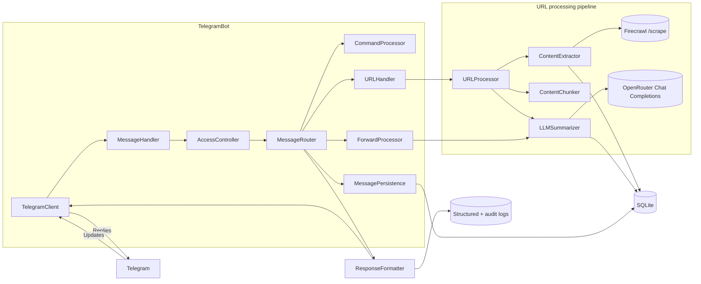

# Bite‑Size Reader

Async Telegram bot that summarizes web articles and YouTube videos. For articles, it uses Firecrawl + OpenRouter; for YouTube videos, it downloads the video (1080p) and extracts transcripts. Also supports summarizing forwarded channel posts. Returns a strict JSON summary and stores artifacts in SQLite. See SPEC.md for full details.

## Tech stack
- **Async Telegram bot** powered by [Pyrogram](https://docs.pyrogram.org/) with `tgcrypto` for encryption acceleration and `uvloop` for faster event loops.
- **Content extraction + NLP** built on `trafilatura` for HTML parsing, `spaCy` (English + Russian models) for language detection, `sentence-transformers` + `scikit-learn` for embeddings and clustering, and `json_repair` to harden LLM JSON outputs.
- **LLM + web summarization** orchestrated through `httpx` (HTTP/2) clients calling Firecrawl for scraping and OpenRouter for model completions, with optional structured output retries.
- **Persistence** handled via the Peewee ORM targeting SQLite, with audit-friendly correlation IDs on all requests.
- **YouTube pipeline** using `yt-dlp` for downloads, `youtube-transcript-api` for transcripts, and `ffmpeg` tooling in the container image to extract media artifacts.
- **API surface** exposing an optional FastAPI server (run by Uvicorn) plus a CLI entrypoint for local summaries.

## Architecture overview

The bot ingests updates via a lightweight `TelegramClient`, normalizes them through `MessageHandler`, and hands them to `MessageRouter`. The router enforces access control, persists interaction metadata, and dispatches requests either to the command processor, the URL handler (which orchestrates Firecrawl + OpenRouter summarization through `URLProcessor`), or the forward processor for channel reposts. `ResponseFormatter` centralizes Telegram replies and audit logging while all artifacts land in SQLite.

Quick start
- Copy `.env.example` to `.env` and fill required secrets.
- Build and run with Docker.
- See DEPLOYMENT.md for full setup and deployment instructions.
- For production refreshes, follow `docs/server_update_guide.md` for pull + redeploy steps.

Docker
- If you updated dependencies in `pyproject.toml`, generate lock files first: `make lock-uv` (or `make lock-piptools`).
- Build: `docker build -t bite-size-reader .`
- Run: `docker run --env-file .env -v $(pwd)/data:/data --name bsr bite-size-reader`

Environment
- `API_ID`, `API_HASH`, `BOT_TOKEN`, `ALLOWED_USER_IDS`
- `FIRECRAWL_API_KEY`
- `OPENROUTER_API_KEY`, `OPENROUTER_MODEL`, `OPENROUTER_HTTP_REFERER`, `OPENROUTER_X_TITLE`
- `YOUTUBE_DOWNLOAD_ENABLED=true` — Enable/disable YouTube video download feature
- `YOUTUBE_STORAGE_PATH=/data/videos` — Directory for downloaded videos
- `YOUTUBE_MAX_VIDEO_SIZE_MB=500` — Maximum size per video (MB)
- `YOUTUBE_MAX_STORAGE_GB=100` — Maximum total storage for all videos (GB)
- `YOUTUBE_PREFERRED_QUALITY=1080p` — Video quality (1080p, 720p, 480p, etc.)
- `YOUTUBE_SUBTITLE_LANGUAGES=en,ru` — Preferred subtitle/transcript languages
- `YOUTUBE_AUTO_CLEANUP_ENABLED=true` — Enable automatic cleanup of old videos
- `YOUTUBE_CLEANUP_AFTER_DAYS=30` — Delete videos older than N days
- `DB_PATH=/data/app.db`, `LOG_LEVEL=INFO`, `REQUEST_TIMEOUT_SEC=60`
- `DB_BACKUP_ENABLED=1`, `DB_BACKUP_INTERVAL_MINUTES=360`, `DB_BACKUP_RETENTION=14`, `DB_BACKUP_DIR=/data/backups`
- `PREFERRED_LANG=auto` (auto|en|ru)
- `DEBUG_PAYLOADS=0` — when `1`, logs request/response payload previews for Firecrawl/OpenRouter (with Authorization redacted)
 - `MAX_CONCURRENT_CALLS=4` — caps simultaneous Firecrawl/OpenRouter calls

Repository layout
- `app/core` — URL normalization, JSON contract, logging, language helpers
- `app/adapters/content` — Firecrawl integration, content chunking, LLM summarization
- `app/adapters/youtube` — YouTube video download and transcript extraction
- `app/adapters/external` — response formatting helpers shared by adapters
- `app/adapters/openrouter` — OpenRouter client, payload shaping, error handling
- `app/adapters/telegram` — Telegram client, message routing, access control, persistence
- `app/db` — SQLite schema, migrations, audit logging helpers
- `app/models` — Pydantic-style models for Telegram entities and LLM configuration
- `app/utils` — shared validation utilities
- `app/cli` — local CLI runner for summaries
- `app/prompts` — LLM prompt templates
- `bot.py` — entrypoint wiring config, DB, and Telegram bot
- `SPEC.md` — full technical specification

YouTube Video Support
- The bot automatically detects YouTube URLs and processes them differently from regular web articles
- **Supported URL formats:**
  - Standard: `youtube.com/watch?v=VIDEO_ID`
  - Short: `youtu.be/VIDEO_ID`
  - Shorts: `youtube.com/shorts/VIDEO_ID`
  - Live: `youtube.com/live/VIDEO_ID`
  - Embed: `youtube.com/embed/VIDEO_ID` or `youtube-nocookie.com/embed/VIDEO_ID`
  - Mobile: `m.youtube.com/watch?v=VIDEO_ID`
  - Music: `music.youtube.com/watch?v=VIDEO_ID`
  - Legacy: `youtube.com/v/VIDEO_ID`
- **Processing workflow:**
  1. Extract video ID from URL (handles query parameters in any order, e.g., `?feature=share&v=ID`)
  2. Extract transcript using `youtube-transcript-api` (prefers manual transcripts, falls back to auto-generated)
  3. Download video in configured quality (default 1080p) using `yt-dlp`
  4. Download subtitles, metadata (JSON), and thumbnail
  5. Generate summary from transcript using LLM
  6. Store video metadata, file paths, and transcript in database
- **Storage management:**
  - Videos stored in `/data/videos` (configurable)
  - Automatic cleanup of old videos (configurable retention period)
  - Size limits enforced per-video and total storage
  - Deduplication: same video URL won't be downloaded twice
- **Requirements:**
  - `ffmpeg` must be installed (included in Docker image)
  - `yt-dlp` and `youtube-transcript-api` Python packages (in requirements.txt)
- **User notifications:**
  - Bot notifies when YouTube video is detected
  - Shows download progress updates
  - Confirms when download completes with title, resolution, and file size
- **Database schema:**
  - New `video_downloads` table stores all video metadata
  - Links to `requests` table via foreign key for correlation
  - Tracks video ID, file paths, title, channel, duration, views, likes, transcript

Notes
- Dependencies include Pyrogram; if using PyroTGFork, align installation accordingly.
- Bot commands are registered on startup for private chats: `/help`, `/summarize`.
- Python 3.13+ required for all dependencies including scikit-learn for text processing and optional uvloop for async performance.

Commands & usage
- `/help` or `/start` — Show help and usage.
- `/summarize <URL>` — Summarize a URL immediately.
- `/summarize` — Bot will ask you to send a URL in the next message.
- Multiple URLs in one message (or after `/summarize`): bot asks “Process N links?”; reply “yes/no”. Each link gets its own correlation ID and is processed sequentially.
- `/summarize_all <URLs>` — Summarize multiple URLs from one message immediately, without confirmation.
- `/cancel` — Cancel any pending `/summarize` URL prompt or multi-link confirmation.

Local CLI summary runner
- With the same environment variables exported (Firecrawl + OpenRouter keys, DB path, etc.), run `python -m app.cli.summary --url https://example.com/article`.
- Pass full message text instead of `--url` to mimic Telegram input, e.g. `python -m app.cli.summary "/summary https://example.com"`.
- The CLI loads environment variables from `.env` in your current directory (or project root) automatically; override with `--env-file path/to/.env` if needed.
- Add `--accept-multiple` to auto-confirm when multiple URLs are supplied, `--json-path summary.json` to write the final JSON to disk, and `--log-level DEBUG` for verbose traces.
- The insights stage mirrors production: it retries with JSON-schema first, then falls back to JSON-object mode and configured fallback models before giving up, which reduces `structured_output_parse_error` failures during research add-ons.
- The CLI generates stub Telegram credentials automatically, so no real bot token is required for local runs.

Tips
- You can simply send a URL (or several URLs) or forward a channel post — commands are optional.

Errors & correlation IDs
- All user-visible errors include `Error ID: <cid>` to correlate with logs and DB `requests.correlation_id`.

Dev tooling
- Install dev deps: `pip install -r requirements.txt -r requirements-dev.txt`
- Format: `make format` (black + isort + ruff format)
- Lint: `make lint` (ruff)
- Type-check: `make type` (mypy)
- Pre-commit: `pre-commit install` then commits will auto-run hooks
- Optional: `pip install loguru` to enable Loguru-based JSON logging with stdlib bridging

Pre-commit hooks
- Hooks run in this order to minimize churn: Ruff (with `--fix`), isort (profile=black), Black.
- If a first run modifies files, stage the changes and run again.

Local environment
- Create venv: `make venv` (or run `scripts/create_venv.sh`)
- Activate: `source .venv/bin/activate`
- Install deps: `pip install -r requirements.txt -r requirements-dev.txt`

Dependency management
- Source of truth: `pyproject.toml` ([project] deps + [project.optional-dependencies].dev).
- Locked requirements are generated to `requirements.txt` and `requirements-dev.txt`.
- With uv (recommended):
  - Install: `curl -Ls https://astral.sh/uv/install.sh | sh`
  - Lock: `make lock-uv`
- With pip-tools:
  - `python -m pip install pip-tools`
  - Lock: `make lock-piptools`
- Regenerate locks after changing dependencies in `pyproject.toml`.

CI
- GitHub Actions workflow `.github/workflows/ci.yml` enforces:
  - Lockfile freshness (rebuilds from `pyproject.toml` and checks diff)
  - Lint (ruff), format check (black, isort), type check (mypy)
  - Unit tests (unittest)
  - Matrix tests with and without Pydantic installed to exercise both validation paths
  - Docker image build on every push/PR; optional push to GHCR when `PUBLISH_DOCKER` repository variable is set to `true` (non-PR events)
  - Security checks: Bandit (SAST), pip-audit + Safety (dependency vulns)
  - Secrets scanning: Gitleaks on workspace and full history (history only on push)

Docker publishing (optional)
- Enable publishing to GitHub Container Registry (GHCR):
  - In repository settings → Variables, add `PUBLISH_DOCKER=true`.
  - Ensure workflow permissions include `packages: write` (already configured).
  - Images are tagged as:
    - `ghcr.io/<owner>/<repo>:latest` (on main)
    - `ghcr.io/<owner>/<repo>:<git-sha>`

Automated lockfile PRs
- Workflow `.github/workflows/update-locks.yml` watches `pyproject.toml` and opens a PR to refresh `requirements*.txt` using uv.
- Auto-merge is enabled for that PR; once CI passes, GitHub will automatically merge it.
- You can also trigger it manually from the Actions tab.
