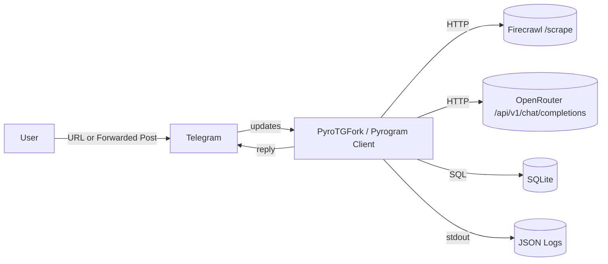

# Bite‑Size Reader — Technical Specification

## Summary

Telegram service that accepts either:
1) a **URL** -> parses it with **Firecrawl** to get clean Markdown/HTML/metadata -> summarizes via **OpenRouter** Chat Completions -> replies with a **strict JSON summary** -> persists *all* artifacts in SQLite.
2) a **forwarded channel message** -> summarizes via **OpenRouter** -> replies with JSON summary -> persists *full Telegram message snapshot* and raw LLM call.

Everything runs in one Docker container; code lives on GitHub. Access is restricted to the owner’s Telegram ID.

## Goals & Non‑Goals

### Goals
- Robust URL -> content -> LLM -> JSON summary pipeline.
- End‑to‑end data capture: Telegram request, full Firecrawl output, raw LLM response, final JSON summary.
- Deterministic **Summary JSON contract** with validation (length caps, types, dedupe).
- Idempotence for URLs (normalized URL hash).
- Clear observability (structured logs, audit trail, latency & token metrics).
- Single‑user security hardening (whitelist).

### Non‑Goals
- Multi‑tenant access control.
- Long‑term vector search, RAG, or analytics dashboards (can be future work).
- Real‑time streaming summaries.

## External systems & authoritative docs

- **Firecrawl** — converts pages into LLM‑ready content; handles proxies, caching, JS, PDFs; outputs **markdown**, **structured**, **screenshots**, **html**.
  Docs: Scrape Feature & Examples — https://docs.firecrawl.dev/features/scrape
  API Reference (Scrape endpoint) — https://docs.firecrawl.dev/api-reference/endpoint/scrape
  Advanced guide — https://docs.firecrawl.dev/advanced-scraping-guide
  Project — https://www.firecrawl.dev/

- **OpenRouter** — unified **Chat Completions** endpoint compatible with OpenAI schema; requires `Authorization: Bearer`; supports optional attribution headers `HTTP-Referer`, `X-Title`.
  Overview — https://openrouter.ai/docs/api-reference/overview
  Chat Completions — https://openrouter.ai/docs/api-reference/chat-completion
  Quickstart — https://openrouter.ai/docs/quickstart

- **PyroTGFork (Pyrogram fork)** — async MTProto framework for Telegram (user/bot).
  Fork site — https://telegramplayground.github.io/pyrogram/
  Setup/Updates/Examples — `start/` pages on the same site (e.g., `/start/setup.html`, `/start/updates.html`, `/start/examples/`).
  Upstream Pyrogram reference (types like `Message`, forwarding fields):
  Client — https://docs.pyrogram.org/api/client
  Message — https://docs.pyrogram.org/api/types/Message

> Note: Pyrogram upstream is no longer maintained; this project uses the **PyroTGFork** mirror/documentation while keeping APIs compatible.

## User & Access Control

- **Single user only**: hard whitelist with `ALLOWED_USER_IDS` (comma‑separated).
- Reject group/supergroup chats and non‑owner DMs with a generic message.
- All secrets pass via env vars; no secrets in DB or logs.

---

## High‑level architecture



## Inputs & Outputs

### Inputs
- **URL message**: text contains a valid URL -> “URL flow”.
- **Forwarded channel post**: `forward_from_chat`, `forward_from_message_id`, `forward_date` present -> “Forward flow”.
- Optional: language preference switch (ru/en) via config; default is language detection of input.

### Output to Telegram
- A **single JSON object** (Summary JSON contract below), sent as a code block or file (when large).

---

## Summary JSON contract (canonical)

**Object fields (strict):**
```json
{
  "summary_250": "string, <= 250 chars",
  "summary_1000": "string, <= 1000 chars",
  "tldr": "string, multi-sentence (no hard cap)",
  "key_ideas": ["idea 1", "idea 2", "idea 3", "idea 4", "idea 5"],
  "topic_tags": ["#tag1", "#tag2", "#tag3"],
  "entities": {
    "people": ["..."],
    "organizations": ["..."],
    "locations": ["..."]
  },
  "estimated_reading_time_min": 7,
  "key_stats": [
    { "label": "Market size", "value": 12.3, "unit": "BUSD", "source_excerpt": "..." }
  ],
  "answered_questions": ["What is ...?", "How does ...?"],
  "readability": {
    "method": "Flesch-Kincaid",
    "score": 12.4,
    "level": "College"
  },
  "seo_keywords": ["keyword one", "keyword two", "keyword three"]
}
```

**Validation rules**
- `summary_250`: hard cap; end on sentence/phrase boundary.
- `summary_1000`: hard cap; multi-sentence overview that expands on `summary_250` while staying within 1000 characters.
- `tldr`: no hard cap but should remain purposeful and avoid rambling.
- `topic_tags`: enforce leading `#`; dedupe; max 10.
- `entities`: lists deduped case‑insensitively.
- `estimated_reading_time_min`: integer; compute from words/WPM or accept LLM value (choose one method and record it).
- `readability.level`: map score->bucket (e.g., College).
- Persist **verbatim** in DB; optionally denormalize for search.

---

## Data model (SQLite)

### Tables
- **users**:
  `telegram_user_id (PK) | username | is_owner | created_at`

- **chats**:
  `chat_id (PK) | type | title | username | created_at`

- **requests** *(one per submission)*:
  ```
  id (PK)
  created_at
  type                 -- 'url' | 'forward'
  status               -- 'pending'|'ok'|'error'
  chat_id (FK)
  user_id (FK)
  input_url            -- as sent
  normalized_url
  dedupe_hash          -- sha256(normalized_url)
  input_message_id
  fwd_from_chat_id
  fwd_from_msg_id
  lang_detected
  route_version
  ```

- **telegram_messages** *(full snapshot)*:
  ```
  id (PK)
  request_id (FK, unique)
  message_id
  chat_id
  date_ts
  text_full
  entities_json
  media_type
  media_file_ids_json
  forward_from_chat_id
  forward_from_chat_type
  forward_from_chat_title
  forward_from_message_id
  forward_date_ts
  telegram_raw_json
  ```

- **crawl_results** *(Firecrawl /scrape)*:
  ```
  id (PK)
  request_id (FK, unique)
  source_url
  endpoint                 -- '/v1/scrape'
  http_status
  status                   -- 'ok'|'error'
  options_json             -- formats, mobile, pdf, actions, timeouts
  content_markdown         -- full cleaned content
  content_html
  structured_json
  metadata_json            -- meta, og, canonical, etc.
  links_json               -- outlinks
  screenshots_paths_json   -- saved local paths if any
  raw_response_json
  latency_ms
  error_text
  ```

- **llm_calls** *(OpenRouter Chat Completions)*:
  ```
  id (PK)
  request_id (FK)
  provider                 -- 'openrouter'
  model
  endpoint                 -- '/api/v1/chat/completions'
  request_headers_json     -- Authorization redacted; include HTTP-Referer/X-Title if used
  request_messages_json    -- Chat 'messages' array
  response_text            -- assistant text if present
  response_json            -- full payload (choices, usage, id)
  tokens_prompt
  tokens_completion
  cost_usd
  latency_ms
  status                   -- 'ok'|'error'
  error_text
  created_at
  ```

- **summaries** *(what we send back)*:
  ```
  id (PK)
  request_id (FK, unique)
  lang
  json_payload             -- exact JSON object returned to user
  version                  -- start at 1; bump on regenerate
  created_at
  ```

- **(Optional indexing/analytics)**
  `summary_topics(request_id FK, hashtag)`
  `summary_entities(request_id FK, type, value)`
  `summary_stats(request_id FK, name, value, unit, source_excerpt)`
  `audit_logs(ts, level, event, details_json)`

### UML — Data (Mermaid class diagram)


---

## Processing pipelines

### URL flow
1) Detect URL; create `requests` row (`type='url'`), normalize URL, compute `dedupe_hash`.
2) **Firecrawl `/scrape`**
   - **Formats**: request at least `markdown`; optionally `html`, `structured`, `screenshot`.
   - **Options**: `mobile` emulation (responsive), `parsers: ["pdf"]` for PDFs, “actions” for dynamic pages.
   - Persist **full raw** response plus extracted content fields.
3) Build LLM prompt from Firecrawl **markdown** (+ metadata).
4) **OpenRouter /api/v1/chat/completions**
   - Headers: `Authorization: Bearer <KEY>`, optional `HTTP-Referer`, `X-Title`.
   - Body: `model`, `messages` (system+user), sensible `temperature`.
   - Persist **full** response (including `usage`).
5) Validate/shape **Summary JSON**, store in `summaries`, reply to user.
6) Optional **additional insights** call:
   - Reuse article content to request contextual insights (recent facts, open questions).
   - Attempt structured `json_schema` response first; if `structured_output_parse_error` occurs, retry with JSON-object mode and configured fallback models before abandoning.
   - Persist successful insights payload alongside the summary version.
7) Log audit events with correlation IDs; record latencies.

### Forwarded message flow
1) Detect forwarded message via `forward_from_chat`, `forward_from_message_id`, `forward_date`; snapshot **entire `Message`** object (text, entities, media ids, raw JSON).
2) Build LLM prompt directly from message text/caption; include channel name/title if present.
3) Call OpenRouter; validate **Summary JSON**; store and reply.

---

## URL normalization & deduplication

- Lowercase scheme & host, strip fragment, sort query params, remove tracking params (configurable), collapse trailing slash.
- Compute `sha256(normalized_url)` -> `requests.dedupe_hash` (unique index).
- If repeat seen, reuse existing `crawl_results` unless `--force` is requested.

---

## Error handling & retries

- **Firecrawl**: retry 3× with exponential backoff on 5xx/timeouts; toggle `mobile`/`parsers` on PDFs; record `http_status` and `error_text`.
- **OpenRouter**: retry on 429/5xx; allow model fallback; always persist failing payload.
- Telegram send errors -> short user notice + audit log.

---

## Observability

- **Structured JSON logs**: intake, Firecrawl call, OpenRouter call, DB writes, reply send; include correlation IDs and latencies.
- **Audit logs**: external call attempts & outcomes, validation errors.
- **Metrics in logs**: token counts, content size (chars/words), estimated cost.

---

## Performance

- Concurrency limited by semaphore for external calls.
- Timeouts: Firecrawl 30–60s; OpenRouter <= 60s; Telegram send <= 10s.
- Large markdown -> chunking for LLM; still store full content in DB.

## Security

- Strict owner whitelist.
- Redact `Authorization` before persisting headers.
- Validate/escape all text before serializing to JSON reply.
- No PII beyond Telegram identifiers; no data sharing.

## Configuration (env)

```
API_ID=...
API_HASH=...
BOT_TOKEN=...
ALLOWED_USER_IDS=123456789

FIRECRAWL_API_KEY=...

OPENROUTER_API_KEY=...
OPENROUTER_MODEL=openai/gpt-5
OPENROUTER_HTTP_REFERER=https://github.com/po4yka/bite-size-reader
OPENROUTER_X_TITLE=Bite-Size Reader
```

DB & runtime:

```
DB_PATH=/data/app.db
LOG_LEVEL=INFO
REQUEST_TIMEOUT_SEC=60
```

> Local CLI runs (`python -m app.cli.summary`) automatically load environment variables from a `.env` file in the current directory or repository root before invoking `load_config`. You can override the location with `--env-file path/to/.env`.

## Dockerization

- Single image (multi-stage): build -> `python:slim` runtime.
- Mount volume for `/data/app.db`.
- Healthcheck: lightweight DB read and Telegram self-ping (optional).
- Log to stdout; rotate in container runtime if needed.

## Local CLI harness

- Command: `python -m app.cli.summary [--url URL | message text]`.
- Automatically loads `.env` configuration (current directory or repo root) prior to `load_config`; override with `--env-file`.
- Injects stub Telegram credentials when they are absent so the rest of the pipeline can run unchanged.
- Mirrors production behavior: URL dedupe, Firecrawl reuse, structured summary with repair/fallbacks, and optional insights generation.
- Insights requests retry with structured `json_schema` first, downgrade to `json_object`, and cycle through configured fallback models to minimize `structured_output_parse_error` failures.

## Testing

- **Unit**: URL normalization, JSON contract validator, Telegram message snapshot mapper.
- **Integration**: Mock Firecrawl/OpenRouter; golden tests for Summary JSON.
- **E2E**: minimal live tests gated by `E2E=1`.

## Repository layout

```
/app
  /core
  /adapters
  /db
  /prompts
/docker
.env.example
README.md
SPEC.md
```

## Future work

- Optional: store Firecrawl screenshots (object storage) and page text embeddings.
- Web dashboard for search & exports.
- Background re‑summarization with upgraded models.

## Appendix — API specifics (quick references)

### Firecrawl (/scrape)
- Converts URL to **markdown**; can also return **html**, **structured**, **screenshots**. Handles proxies, caching, dynamic content, PDFs.
- Consider `mobile` emulation and `parsers: ["pdf"]`.
- Docs:
  - Feature: https://docs.firecrawl.dev/features/scrape
  - API: https://docs.firecrawl.dev/api-reference/endpoint/scrape
  - Guide: https://docs.firecrawl.dev/advanced-scraping-guide

### OpenRouter (Chat Completions)
- Endpoint: `POST https://openrouter.ai/api/v1/chat/completions`
- Headers: `Authorization: Bearer <KEY>`; optional `HTTP-Referer`, `X-Title`.
- Body: OpenAI‑style `messages` array and `model`.
- Docs:
  - Overview: https://openrouter.ai/docs/api-reference/overview
  - Chat: https://openrouter.ai/docs/api-reference/chat-completion
  - Quickstart: https://openrouter.ai/docs/quickstart

### PyroTGFork / Pyrogram
- Client, handlers, updates, examples: https://telegramplayground.github.io/pyrogram/
- Upstream references for types/methods:
  - Client: https://docs.pyrogram.org/api/client
  - Message (forwarding fields): https://docs.pyrogram.org/api/types/Message
