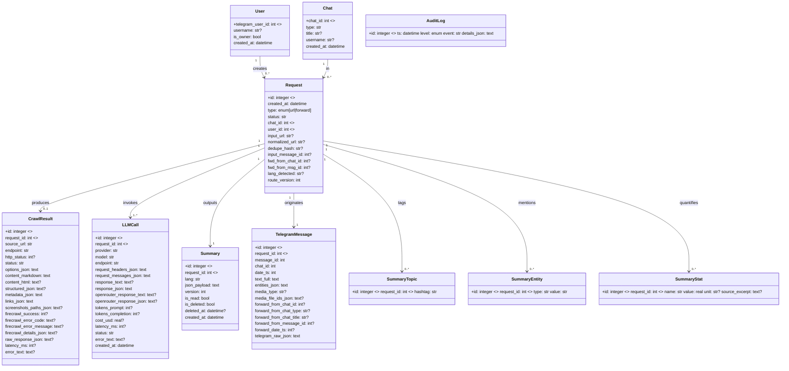

# Bite‑Size Reader — Technical Specification

## Summary

Telegram service that accepts either:
1) a **web article URL** -> parses it with **Firecrawl** to get clean Markdown/HTML/metadata -> summarizes via **OpenRouter** Chat Completions -> replies with a **strict JSON summary** -> persists *all* artifacts in SQLite.
2) a **YouTube video URL** -> downloads video (1080p) with **yt-dlp**, extracts transcript with **youtube-transcript-api** -> summarizes via **OpenRouter** -> replies with JSON summary -> persists *video metadata, file paths, and transcript* in SQLite.
3) a **forwarded channel message** -> summarizes via **OpenRouter** -> replies with JSON summary -> persists *full Telegram message snapshot* and raw LLM call.

Everything runs in one Docker container; code lives on GitHub. Access is restricted to the owner's Telegram ID.

## Goals & Non‑Goals

### Goals
- Robust URL -> content -> LLM -> JSON summary pipeline.
- End‑to‑end data capture: Telegram request, full Firecrawl output, raw LLM response, final JSON summary.
- Deterministic **Summary JSON contract** with validation (length caps, types, dedupe).
- Idempotence for URLs (normalized URL hash).
- Clear observability (structured logs, audit trail, latency & token metrics).
- Single‑user security hardening (whitelist).

### Non‑Goals
- Multi‑tenant access control.
- Long‑term vector search, RAG, or analytics dashboards (can be future work).
- Real‑time streaming summaries.

## External systems & authoritative docs

- **Firecrawl** — converts pages into LLM‑ready content; handles proxies, caching, JS, PDFs; outputs **markdown**, **structured**, **screenshots**, **html**.
  Docs: Scrape Feature & Examples — https://docs.firecrawl.dev/features/scrape
  API Reference (Scrape endpoint) — https://docs.firecrawl.dev/api-reference/endpoint/scrape
  Advanced guide — https://docs.firecrawl.dev/advanced-scraping-guide
  Project — https://www.firecrawl.dev/

- **OpenRouter** — unified **Chat Completions** endpoint compatible with OpenAI schema; requires `Authorization: Bearer`; supports optional attribution headers `HTTP-Referer`, `X-Title`.
  Overview — https://openrouter.ai/docs/api-reference/overview
  Chat Completions — https://openrouter.ai/docs/api-reference/chat-completion
  Quickstart — https://openrouter.ai/docs/quickstart

- **PyroTGFork (Pyrogram fork)** — async MTProto framework for Telegram (user/bot).
  Fork site — https://telegramplayground.github.io/pyrogram/
  Setup/Updates/Examples — `start/` pages on the same site (e.g., `/start/setup.html`, `/start/updates.html`, `/start/examples/`).
  Upstream Pyrogram reference (types like `Message`, forwarding fields):
  Client — https://docs.pyrogram.org/api/client
  Message — https://docs.pyrogram.org/api/types/Message

> Note: Pyrogram upstream is no longer maintained; this project uses the **PyroTGFork** mirror/documentation while keeping APIs compatible.

- **yt-dlp** — YouTube video downloader (actively maintained fork of youtube-dl).
  Documentation — https://github.com/yt-dlp/yt-dlp#readme
  Supported sites — https://github.com/yt-dlp/yt-dlp/blob/master/supportedsites.md
  Requires **ffmpeg** for merging video/audio streams

- **youtube-transcript-api** — Python library to extract YouTube video transcripts.
  Documentation — https://github.com/jdepoix/youtube-transcript-api
  Supports manual and auto-generated transcripts in multiple languages

## User & Access Control

- **Single user only**: hard whitelist with `ALLOWED_USER_IDS` (comma‑separated).
- Reject group/supergroup chats and non‑owner DMs with a generic message.
- All secrets pass via env vars; no secrets in DB or logs.

---

## High‑level architecture


Incoming updates are normalized via `MessageHandler`, which delegates access checks to `AccessController` and durable logging to `MessagePersistence`. Authorized interactions are routed to either command handling, URL processing (Firecrawl → OpenRouter), or forwarded message summarization. `ResponseFormatter` provides a single path for replies, edits, and error handling while emitting structured logs and audit events.

### Telegram message routing


## Inputs & Outputs

### Inputs
- **URL message**: text contains a valid URL -> “URL flow”.
- **Forwarded channel post**: `forward_from_chat`, `forward_from_message_id`, `forward_date` present -> “Forward flow”.
- Optional: language preference switch (ru/en) via config; default is language detection of input.

### Output to Telegram
- A **single JSON object** (Summary JSON contract below), sent as a code block or file (when large).

### Response envelopes (API / CLI / Telegram attachments)
- All outward JSON responses use a **SuccessResponse/ErrorResponse** envelope:
  - `success: bool`
  - `data` (for success) or `error { code, message, details?, correlation_id }`
  - `meta { correlation_id, timestamp, version, build?, pagination?, debug? }`
- Pagination block (when applicable): `{ total, limit, offset, has_more }`.
- **Correlation ID** is generated by middleware (API) or the calling flow (Telegram/CLI) and echoed in meta (and error detail).
- FastAPI endpoints always return the envelope; Telegram structured replies and CLI outputs attach the same envelope JSON (text replies may only mention the correlation/error ID).

---

## Summary JSON contract (canonical)

**Object fields (strict):**
```json
{
  "summary_250": "string, <= 250 chars",
  "summary_1000": "string, <= 1000 chars",
  "tldr": "string, multi-sentence (no hard cap)",
  "key_ideas": ["idea 1", "idea 2", "idea 3", "idea 4", "idea 5"],
  "topic_tags": ["#tag1", "#tag2", "#tag3"],
  "entities": {
    "people": ["..."],
    "organizations": ["..."],
    "locations": ["..."]
  },
  "estimated_reading_time_min": 7,
  "key_stats": [
    { "label": "Market size", "value": 12.3, "unit": "BUSD", "source_excerpt": "..." }
  ],
  "answered_questions": ["What is ...?", "How does ...?"],
  "readability": {
    "method": "Flesch-Kincaid",
    "score": 12.4,
    "level": "College"
  },
  "seo_keywords": ["keyword one", "keyword two", "keyword three"]
}
```

**Validation rules**
- `summary_250`: hard cap; end on sentence/phrase boundary.
- `summary_1000`: hard cap; multi-sentence overview that expands on `summary_250` while staying within 1000 characters.
- `tldr`: no hard cap but should remain purposeful and avoid rambling.
- `topic_tags`: enforce leading `#`; dedupe; max 10.
- `entities`: lists deduped case‑insensitively.
- `estimated_reading_time_min`: integer; compute from words/WPM or accept LLM value (choose one method and record it).
- `readability.level`: map score->bucket (e.g., College).
- Persist **verbatim** in DB; optionally denormalize for search.

---

## Data model (SQLite)

### Tables
- **users**:
  `telegram_user_id (PK) | username | is_owner | created_at`

- **chats**:
  `chat_id (PK) | type | title | username | created_at`

- **requests** *(one per submission)*:
  ```
  id (PK)
  created_at
  type                 -- 'url' | 'forward'
  status               -- 'pending'|'ok'|'error'
  chat_id (FK)
  user_id (FK)
  input_url            -- as sent
  normalized_url
  dedupe_hash          -- sha256(normalized_url)
  input_message_id
  fwd_from_chat_id
  fwd_from_msg_id
  lang_detected
  route_version
  ```

- **telegram_messages** *(full snapshot)*:
  ```
  id (PK)
  request_id (FK, unique)
  message_id
  chat_id
  date_ts
  text_full
  entities_json
  media_type
  media_file_ids_json
  forward_from_chat_id
  forward_from_chat_type
  forward_from_chat_title
  forward_from_message_id
  forward_date_ts
  telegram_raw_json
  ```

- **crawl_results** *(Firecrawl /scrape)*:
  ```
  id (PK)
  request_id (FK, unique)
  source_url
  endpoint                 -- '/v1/scrape'
  http_status
  status                   -- 'ok'|'error'
  options_json             -- formats, mobile, pdf, actions, timeouts
  content_markdown         -- full cleaned content
  content_html
  structured_json
  metadata_json            -- meta, og, canonical, etc.
  links_json               -- outlinks
  screenshots_paths_json   -- saved local paths if any
  firecrawl_success        -- Firecrawl success boolean (0/1)
  firecrawl_error_code     -- Firecrawl error code when present
  firecrawl_error_message  -- Firecrawl-provided error message
  firecrawl_details_json   -- Firecrawl error details array/object
  raw_response_json        -- legacy payload (kept for backward compatibility)
  latency_ms
  error_text
  ```

- **video_downloads** *(YouTube video downloads with yt-dlp and youtube-transcript-api)*:
  ```
  id (PK)
  request_id (FK, unique)
  created_at
  video_id                     -- YouTube video ID (11 chars)
  status                       -- 'pending'|'downloading'|'completed'|'error'
  video_file_path              -- path to downloaded MP4 file
  subtitle_file_path           -- path to subtitle/caption VTT file
  metadata_file_path           -- path to yt-dlp metadata JSON file
  thumbnail_file_path          -- path to thumbnail image
  title                        -- video title
  channel                      -- channel name/uploader
  channel_id                   -- YouTube channel ID
  duration_sec                 -- video duration in seconds
  upload_date                  -- upload date from YouTube (YYYYMMDD format)
  view_count                   -- view count at download time
  like_count                   -- like count at download time
  resolution                   -- e.g. '1080p', '720p'
  file_size_bytes              -- downloaded video file size
  video_codec                  -- e.g. 'avc1', 'vp9'
  audio_codec                  -- e.g. 'mp4a', 'opus'
  format_id                    -- yt-dlp format ID used
  transcript_text              -- full transcript text (from youtube-transcript-api)
  transcript_source            -- 'youtube-transcript-api' or 'yt-dlp-subtitles'
  subtitle_language            -- language code (e.g. 'en', 'ru')
  auto_generated               -- boolean: transcript auto-generated (0/1)
  download_started_at          -- timestamp when download started
  download_completed_at        -- timestamp when download completed
  error_text                   -- error message if status='error'
  ```

- **llm_calls** *(OpenRouter Chat Completions)*:
  ```
  id (PK)
  request_id (FK)
  provider                 -- 'openrouter'
  model
  endpoint                 -- '/api/v1/chat/completions'
  request_headers_json     -- Authorization redacted; include HTTP-Referer/X-Title if used
  request_messages_json    -- Chat 'messages' array
  response_text            -- assistant text if present
  response_json            -- full payload (choices, usage, id)
  openrouter_response_text -- raw text from OpenRouter completion
  openrouter_response_json -- raw JSON payload from OpenRouter
  tokens_prompt
  tokens_completion
  cost_usd
  latency_ms
  status                   -- 'ok'|'error'
  error_text
  created_at
  ```

- **summaries** *(what we send back)*:
  ```
  id (PK)
  request_id (FK, unique)
  lang
  json_payload             -- exact JSON object returned to user
  version                  -- start at 1; bump on regenerate
  created_at
  ```

- **(Optional indexing/analytics)**
  `summary_topics(request_id FK, hashtag)`
  `summary_entities(request_id FK, type, value)`
  `summary_stats(request_id FK, name, value, unit, source_excerpt)`
  `audit_logs(ts, level, event, details_json)`

### UML — Data (Mermaid class diagram)


---

## Processing pipelines

### URL flow
1) `MessageRouter` classifies the interaction, persists a `requests` row (`type='url'`), normalizes the URL, and records the `dedupe_hash` via `MessagePersistence`.
2) `URLProcessor.content_extractor` invokes **Firecrawl `/scrape`**:
   - **Formats**: always request `markdown`; optionally add `html`, `structured`, `screenshot` based on config.
   - **Options**: `mobile` emulation, `parsers: ["pdf"]`, scripted “actions” for dynamic pages.
   - Persist the full raw response, extracted content, metadata, and latency telemetry in SQLite.
3) `URLProcessor` determines language, loads the matching system prompt, and reports detection back to the user through `ResponseFormatter`.
4) `ContentChunker` decides whether to chunk. When chunking is enabled it fans out concurrent OpenRouter calls and aggregates responses; otherwise it hands the full article to `LLMSummarizer`.
5) `LLMSummarizer` calls **OpenRouter /api/v1/chat/completions** with structured output hints, automatic provider/model fallbacks, and optional long-context support:
   - Headers: `Authorization: Bearer <KEY>`, optional `HTTP-Referer`, `X-Title`.
   - Body: base model plus fallback cascade, `messages` (system + user), tuned `temperature`.
   - Persist every request/response pair (including usage) and derived token/cost metrics.
6) Shape and validate the Summary JSON contract; store in `summaries` and send through `ResponseFormatter` (code block or file depending on size).
7) Optional **insights** stage reuses the same pipeline: attempt `json_schema` outputs first, downgrade to JSON-object mode, and iterate through configured fallback models until successful or exhausted.
8) Emit audit logs (start/end, retries, errors) with the correlation ID for full traceability.

### Forwarded message flow
1) `MessageRouter` detects forwarded metadata, snapshots the full Telegram message via `MessagePersistence`, and writes a `requests` row (`type='forward'`).
2) `ForwardProcessor` builds an LLM prompt from the snapshot (channel name/title + text/caption) and calls **OpenRouter** with the same structured output pipeline used for URLs.
3) Persist the LLM payload, validated Summary JSON, and audit events; reply via `ResponseFormatter`.

### YouTube video flow
1) `ContentExtractor` detects YouTube URLs via `url_utils.is_youtube_url()` and routes to `YouTubeDownloader`.
2) **YouTube URL patterns** supported (all major formats):
   - Standard: `youtube.com/watch?v=VIDEO_ID` (handles query params in any order, e.g., `?feature=share&v=ID`)
   - Short: `youtu.be/VIDEO_ID`
   - Shorts: `youtube.com/shorts/VIDEO_ID`
   - Live: `youtube.com/live/VIDEO_ID`
   - Embed: `youtube.com/embed/VIDEO_ID` or `youtube-nocookie.com/embed/VIDEO_ID`
   - Mobile: `m.youtube.com/watch?v=VIDEO_ID`
   - Music: `music.youtube.com/watch?v=VIDEO_ID`
   - Legacy: `youtube.com/v/VIDEO_ID`
3) **Deduplication**: URL is normalized and hashed (`dedupe_hash`) just like regular URLs; existing `video_downloads` are reused if status is 'completed'.
4) **Transcript extraction** (via **youtube-transcript-api**):
   - Prefers manually created transcripts in configured languages (`YOUTUBE_SUBTITLE_LANGUAGES`)
   - Falls back to auto-generated transcripts if no manual transcript available
   - Continues download even if transcript unavailable (stores empty transcript)
   - Transcript text is formatted for LLM processing (timestamps removed, text joined)
5) **Video download** (via **yt-dlp**):
   - Runs in thread pool (`asyncio.to_thread`) to avoid blocking async event loop
   - Downloads best video up to configured quality (default 1080p) + best audio
   - Merges video/audio streams using **ffmpeg** to single MP4 file
   - Also downloads: subtitles (VTT), metadata (JSON), thumbnail (image)
   - Storage organized by date: `/data/videos/YYYYMMDD/VIDEO_ID_title.mp4`
   - Enforces size limits: per-video max (`YOUTUBE_MAX_VIDEO_SIZE_MB`) and total storage (`YOUTUBE_MAX_STORAGE_GB`)
6) **Metadata extraction and persistence**:
   - Creates `video_downloads` row with comprehensive metadata: title, channel, duration, views, likes, resolution, codecs, file paths
   - Stores transcript text and source (`youtube-transcript-api` or `yt-dlp-subtitles`)
   - Links to `requests` table via foreign key for correlation
7) **Error handling** (user-friendly messages for common failures):
   - Age-restricted videos: "Sign in to confirm your age" error
   - Geo-blocked: "Not available in your country" error
   - Private/deleted: "Video unavailable" error
   - Members-only: YouTube Premium/channel membership required
   - Scheduled premiere: "Live event will begin" error
   - Rate limits: HTTP 429 "Too many requests" error
   - Network errors: Timeout and connection failures
   - Transcript disabled: Continues with empty transcript
8) **User notifications**:
   - Initial: "YouTube Video Detected - Downloading video in 1080p..."
   - Completion: "Video Downloaded Successfully! Title, resolution, file size..."
   - Then proceeds to LLM summarization
9) **Summarization**: Transcript is passed to `LLMSummarizer` using the same pipeline as regular URLs; Summary JSON contract is validated and sent via `ResponseFormatter`.
10) **Storage management**:
    - Auto-cleanup enabled by default (`YOUTUBE_AUTO_CLEANUP_ENABLED`)
    - Removes videos older than configured retention period (`YOUTUBE_CLEANUP_AFTER_DAYS`)
    - Monitors storage usage and warns at 90% threshold

---

## URL normalization & deduplication

- Lowercase scheme & host, strip fragment, sort query params, remove tracking params (configurable), collapse trailing slash.
- Compute `sha256(normalized_url)` -> `requests.dedupe_hash` (unique index).
- If repeat seen, reuse existing `crawl_results` unless `--force` is requested.

---

## Error handling & retries

- **Firecrawl**: retry 3× with exponential backoff on 5xx/timeouts; toggle `mobile`/`parsers` on PDFs; record `http_status` and `error_text`.
- **OpenRouter**: retry on 429/5xx; allow model fallback; always persist failing payload.
- Telegram send errors -> short user notice + audit log.

---

## Observability

- **Structured JSON logs**: intake, Firecrawl call, OpenRouter call, DB writes, reply send; include correlation IDs and latencies.
- **Audit logs**: external call attempts & outcomes, validation errors.
- **Metrics in logs**: token counts, content size (chars/words), estimated cost.

---

## Performance

- Concurrency limited by semaphore for external calls.
- Timeouts: Firecrawl 30–60s; OpenRouter <= 60s; Telegram send <= 10s.
- Large markdown -> chunking for LLM; still store full content in DB.

## Security

- Strict owner whitelist.
- Redact `Authorization` before persisting headers.
- Validate/escape all text before serializing to JSON reply.
- No PII beyond Telegram identifiers; no data sharing.

## Configuration (env)

```
API_ID=...
API_HASH=...
BOT_TOKEN=...
ALLOWED_USER_IDS=123456789

FIRECRAWL_API_KEY=...

OPENROUTER_API_KEY=...
OPENROUTER_MODEL=qwen/qwen3-max
OPENROUTER_FALLBACK_MODELS=deepseek/deepseek-r1,moonshotai/kimi-k2-thinking,deepseek/deepseek-v3.2
OPENROUTER_LONG_CONTEXT_MODEL=moonshotai/kimi-k2-thinking
OPENROUTER_HTTP_REFERER=https://github.com/po4yka/bite-size-reader
OPENROUTER_X_TITLE=Bite-Size Reader

YOUTUBE_DOWNLOAD_ENABLED=true
YOUTUBE_STORAGE_PATH=/data/videos
YOUTUBE_MAX_VIDEO_SIZE_MB=500
YOUTUBE_MAX_STORAGE_GB=100
YOUTUBE_PREFERRED_QUALITY=1080p
YOUTUBE_SUBTITLE_LANGUAGES=en,ru
YOUTUBE_AUTO_CLEANUP_ENABLED=true
YOUTUBE_CLEANUP_AFTER_DAYS=30
```

DB & runtime:

```
DB_PATH=/data/app.db
LOG_LEVEL=INFO
REQUEST_TIMEOUT_SEC=60
```

> Local CLI runs (`python -m app.cli.summary`) automatically load environment variables from a `.env` file in the current directory or repository root before invoking `load_config`. You can override the location with `--env-file path/to/.env`.

## Dockerization

- Single image (multi-stage): build -> `python:slim` runtime.
- Runtime includes **ffmpeg** (required for yt-dlp video/audio merging).
- Mount volumes:
  - `/data/app.db` for database
  - `/data/videos` for YouTube video downloads
- Healthcheck: lightweight DB read and Telegram self-ping (optional).
- Log to stdout; rotate in container runtime if needed.

## Local CLI harness

- Command: `python -m app.cli.summary [--url URL | message text]`.
- Automatically loads `.env` configuration (current directory or repo root) prior to `load_config`; override with `--env-file`.
- Injects stub Telegram credentials when they are absent so the rest of the pipeline can run unchanged.
- Mirrors production behavior: URL dedupe, Firecrawl reuse, structured summary with repair/fallbacks, and optional insights generation.
- Insights requests retry with structured `json_schema` first, downgrade to `json_object`, and cycle through configured fallback models to minimize `structured_output_parse_error` failures.

## Testing

- **Unit**: URL normalization, JSON contract validator, Telegram message snapshot mapper.
- **Integration**: Mock Firecrawl/OpenRouter; golden tests for Summary JSON.
- **E2E**: minimal live tests gated by `E2E=1`.

## Repository layout

```
/app
  /core
  /adapters
    /content
    /external
    /openrouter
    /telegram
  /cli
  /db
  /handlers
  /models
  /prompts
  /services
  /utils
/docker
.env.example
README.md
SPEC.md
```

## Mobile API (app/api)

The project includes a RESTful API built with FastAPI to support mobile clients (iOS/Android).

### Authentication
- **Method**: JWT (JSON Web Tokens).
- **Login**: `/v1/auth/telegram-login` accepts Telegram Login Widget data, verifies HMAC-SHA256, and returns access/refresh tokens.
- **Client ID**: All requests must include a valid `client_id`.

### Endpoints
- `POST /v1/auth/telegram-login`: Exchange Telegram auth for JWT.
- `POST /v1/auth/refresh`: Refresh access token.
- `GET /v1/summaries`: List summaries (pagination, filtering by lang/read status).
- `GET /v1/summaries/{id}`: Get full summary details.
- `PATCH /v1/summaries/{id}`: Update summary (e.g. mark as read).
- `DELETE /v1/summaries/{id}`: Soft delete summary.
- `POST /v1/requests`: Submit new URL or forward for processing.
- `GET /v1/requests/{id}/status`: Poll processing status.

### Data Model Additions for API
- **User**: `preferences_json` for client-side settings.
- **Summary**: `is_read`, `is_deleted`, `deleted_at` for state management.

### Rate limiting and sync (Redis-backed)
- **Redis config**: `REDIS_ENABLED` (default true), `REDIS_URL` or `REDIS_HOST`/`REDIS_PORT`/`REDIS_DB`, `REDIS_PASSWORD` (optional), `REDIS_PREFIX` (default `bsr`), `REDIS_REQUIRED` (fail fast if Redis is down), `REDIS_SOCKET_TIMEOUT` (default 5s).
- **API limits**: window `API_RATE_LIMIT_WINDOW_SECONDS` (default 60s), `API_RATE_LIMIT_COOLDOWN_MULTIPLIER` (default 2.0), `API_RATE_LIMIT_MAX_CONCURRENT_PER_USER` (default 3), per-path caps `API_RATE_LIMIT_SUMMARIES` (200), `API_RATE_LIMIT_REQUESTS` (10), `API_RATE_LIMIT_SEARCH` (50), and `API_RATE_LIMIT_DEFAULT` (100).
- **Sync sessions**: stored in Redis with TTL; `SYNC_EXPIRY_HOURS` (default 1h) and `SYNC_DEFAULT_CHUNK_SIZE` (default 100, bounded 1..500). Fallback to in-process cache when Redis is disabled/unavailable (logs warning).
- **Headers/behavior**: `X-RateLimit-Limit`, `X-RateLimit-Remaining`, `X-RateLimit-Reset`; 429 includes `Retry-After` and JSON error with `retry_after`. If Redis is required but unavailable, middleware returns 503 with code `RATE_LIMIT_BACKEND_UNAVAILABLE`.

### Background processing (requests -> summaries)
- **Wiring**: `app/di/background.py` builds `BackgroundProcessor` with `AppConfig`, shared DB, Firecrawl/OpenRouter clients, and Redis (via `app.infrastructure.redis.get_redis`). Called from `process_url_request` in `app/api/background_processor.py`.
- **Idempotent lock**: Redis key `bsr:bg:req:{id}` (`REDIS_PREFIX` applied), `NX` with TTL `BACKGROUND_LOCK_TTL_MS` (default 300000 ms). Config: `BACKGROUND_REDIS_LOCK_ENABLED` (default true), `BACKGROUND_REDIS_LOCK_REQUIRED` (default false), `BACKGROUND_LOCK_SKIP_ON_HELD` (default true). Fallback to local lock if Redis unavailable (warning logged) or disabled.
- **Retries**: exponential backoff with jitter for extraction and LLM (`BACKGROUND_RETRY_ATTEMPTS` default 3, `BACKGROUND_RETRY_BASE_DELAY_MS` 500, `BACKGROUND_RETRY_MAX_DELAY_MS` 5000, `BACKGROUND_RETRY_JITTER_RATIO` 0.2).
- **Errors**: structured log extras `{error_type, error_code, error_stage, correlation_id}`; request status set to `error` on failure. Unknown request types raise validation StageError.
- **Behavior**: skip processing when lock is held; no duplicate summaries when one already exists for the request; status transitions `pending` -> `processing` -> `success`/`error`.

## Future work

- Optional: store Firecrawl screenshots (object storage) and page text embeddings.
- Web dashboard for search & exports.
- Background re‑summarization with upgraded models.

## Appendix — API specifics (quick references)

### Firecrawl (/scrape)
- Converts URL to **markdown**; can also return **html**, **structured**, **screenshots**. Handles proxies, caching, dynamic content, PDFs.
- Consider `mobile` emulation and `parsers: ["pdf"]`.
- Docs:
  - Feature: https://docs.firecrawl.dev/features/scrape
  - API: https://docs.firecrawl.dev/api-reference/endpoint/scrape
  - Guide: https://docs.firecrawl.dev/advanced-scraping-guide

### OpenRouter (Chat Completions)
- Endpoint: `POST https://openrouter.ai/api/v1/chat/completions`
- Headers: `Authorization: Bearer <KEY>`; optional `HTTP-Referer`, `X-Title`.
- Body: OpenAI‑style `messages` array and `model`.
- Docs:
  - Overview: https://openrouter.ai/docs/api-reference/overview
  - Chat: https://openrouter.ai/docs/api-reference/chat-completion
  - Quickstart: https://openrouter.ai/docs/quickstart

### PyroTGFork / Pyrogram
- Client, handlers, updates, examples: https://telegramplayground.github.io/pyrogram/
- Upstream references for types/methods:
  - Client: https://docs.pyrogram.org/api/client
  - Message (forwarding fields): https://docs.pyrogram.org/api/types/Message
