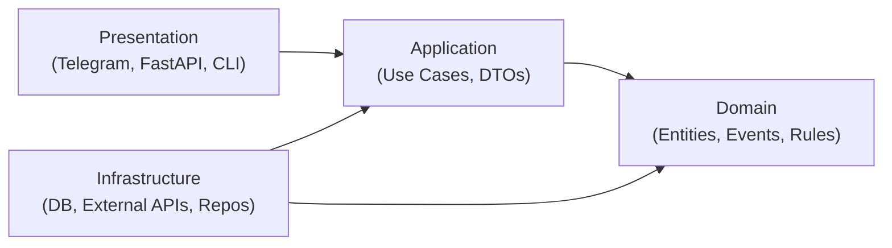
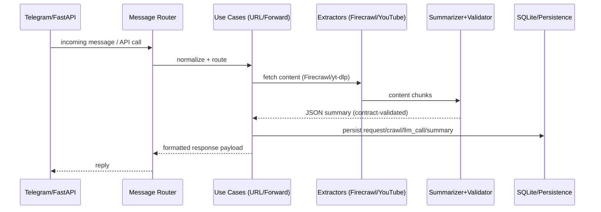

# Hexagonal Architecture Quickstart (Bite-Size Reader)

This doc keeps our layering consistent across Telegram, CLI, and the mobile API. Keep dependencies pointing inward: Domain has no outward dependencies.

## Layer Map (project-specific)
- Presentation: `app/adapters/telegram/*`, `app/api/*`, CLI in `app/cli/*`
- Application: `app/application/use_cases/*`, DTOs in `app/application/dto/*`
- Domain: `app/domain/*` (models, events, services, exceptions)
- Infrastructure: `app/infrastructure/*`, `app/db/*`, external clients in `app/adapters/*`
- DI: `app/di/container.py`

## Core flow we run every day

## Quickstart: add a new use case
1) Domain: add/adjust entities or domain services in `app/domain/*` (no external deps).
2) Application: create a use case in `app/application/use_cases/` that orchestrates domain + repositories.
3) Infrastructure: ensure repository/client implementations exist in `app/infrastructure/*` or `app/adapters/*`.
4) DI: wire it in `app/di/container.py`.
5) Presentation: call the use case from Telegram handlers (`app/adapters/telegram/*`) or FastAPI (`app/api/*`), formatting responses via `app/adapters/external/response_formatter.py`.

## When to add a use case
- Any distinct workflow (e.g., mark summary read, search summaries, sync mobile).
- Reads: use query objects; writes: use command objects.

## Testing hints
- Unit: pure domain rules and use cases with mocked repositories.
- Integration: run via container wiring against test DB; validate persistence and contracts.
