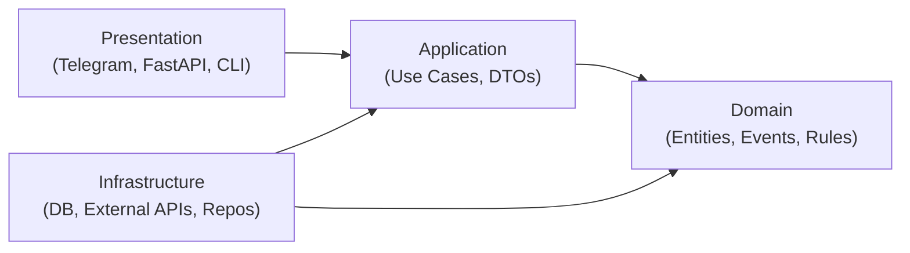
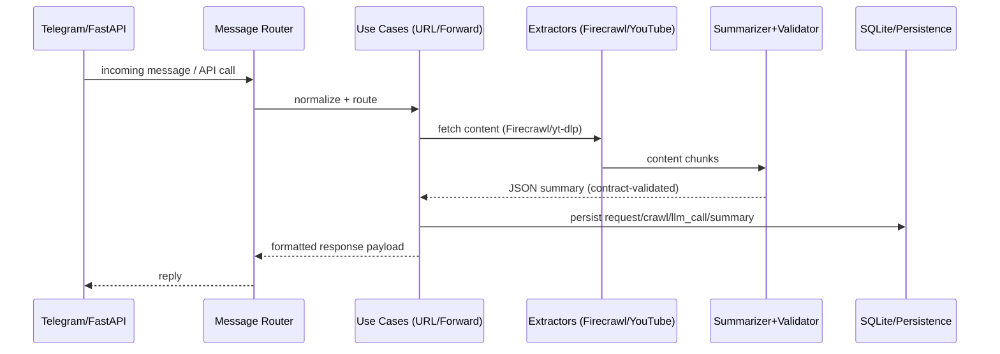

# Hexagonal Architecture Quickstart (Bite-Size Reader)

This doc keeps our layering consistent across Telegram, CLI, and the mobile API. Keep dependencies pointing inward: Domain has no outward dependencies.

## Runtime policy

- DI container is always enabled in runtime entrypoints (Telegram bot and CLI harness).
- Presentation handlers call application use cases for business workflows.
- No presentation-layer fallback path should call repositories directly for the same workflow.
- FastAPI routers remain transport-only: orchestration belongs in dedicated application/service classes.
- Adapter seams should depend on protocol contracts, not concrete `*Impl` classes, at constructor/public boundaries.

## Layer Map (project-specific)

- Presentation: `app/adapters/telegram/*`, `app/api/*`, CLI in `app/cli/*`
- Application: `app/application/use_cases/*`, DTOs in `app/application/dto/*`
- Domain: `app/domain/*` (models, events, services, exceptions)
- Infrastructure: `app/infrastructure/*`, `app/db/*`, external clients in `app/adapters/*`
- DI: `app/di/container.py`

## Legacy DB Facade Layout

- `app/db/database.py` is a backward-compatible facade around `DatabaseSessionManager`.
- Facade operations are split into focused mixins:
  - `app/db/database_user_ops.py`
  - `app/db/database_request_ops.py`
  - `app/db/database_summary_ops.py`
  - `app/db/database_embedding_media_ops.py`
- New business workflows should go through application use cases and repository ports in `app/infrastructure/persistence/sqlite/repositories/*`, not directly through the facade.

## Current seam examples (2026-03)

- `app/api/routers/digest.py` → delegates orchestration to `DigestFacade`.
- `app/api/routers/system.py` → delegates DB/Redis/file maintenance work to `SystemMaintenanceService`.
- Telegram callback flow delegates action execution through `CallbackActionRegistry` + `CallbackActionService`.
- Telegram URL flow delegates security/timeout/batch/state policy through `URLBatchPolicyService` + `URLAwaitingStateStore`.
- Formatting stack constructor seams use protocol interfaces from `app/adapters/external/formatting/protocols.py` (for example `ResponseSender`, `DataFormatter`, `TextProcessor`) instead of concrete implementation types.

```mermaid
flowchart LR
  Presentation["Presentation\n(Telegram, FastAPI, CLI)"]
  Application["Application\n(Use Cases, DTOs)"]
  Domain["Domain\n(Entities, Events, Rules)"]
  Infrastructure["Infrastructure\n(DB, External APIs, Repos)"]

  Presentation --> Application --> Domain
  Infrastructure --> Application
  Infrastructure --> Domain
```

## Core flow we run every day

```mermaid
sequenceDiagram
  participant TG as Telegram/FastAPI
  participant Router as Message Router
  participant UC as Use Cases (URL/Forward)
  participant Extract as Extractors (Firecrawl/YouTube)
  participant LLM as Summarizer+Validator
  participant DB as SQLite/Persistence

  TG->>Router: incoming message / API call
  Router->>UC: normalize + route
  UC->>Extract: fetch content (Firecrawl/yt-dlp)
  Extract->>LLM: content chunks
  LLM-->>UC: JSON summary (contract-validated)
  UC->>DB: persist request/crawl/llm_call/summary
  UC-->>Router: formatted response payload
  Router-->>TG: reply
```

## Quickstart: add a new use case

1) Domain: add/adjust entities or domain services in `app/domain/*` (no external deps).
2) Application: create a use case in `app/application/use_cases/` that orchestrates domain + repositories.
3) Infrastructure: ensure repository/client implementations exist in `app/infrastructure/*` or `app/adapters/*`.
4) DI: wire it in `app/di/container.py`.
5) Presentation: call the use case from Telegram handlers (`app/adapters/telegram/*`) or FastAPI (`app/api/*`), formatting responses via `app/adapters/external/response_formatter.py`.

## When to add a use case

- Any distinct workflow (e.g., mark summary read, search summaries, sync mobile).
- Reads: use query objects; writes: use command objects.

## Testing hints

- Unit: pure domain rules and use cases with mocked repositories.
- Integration: run via container wiring against test DB; validate persistence and contracts.
