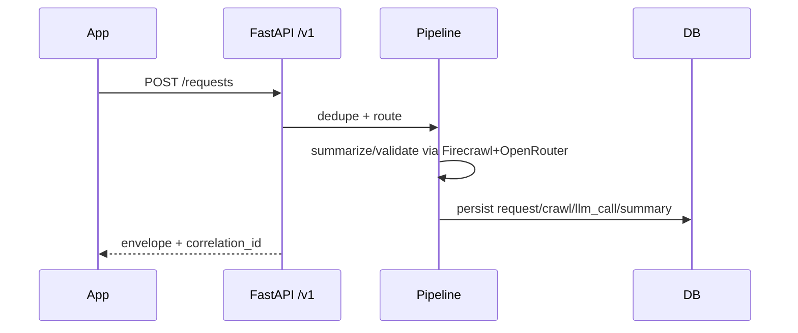

# Mobile API - Quick Start

Focused runbook for the `/v1` FastAPI surface used by the mobile app.

## What matters
- Envelopes only: `success`, `data|error`, `meta.timestamp`, `meta.version`, `X-Correlation-ID` echoed.
- Auth: JWT via Telegram login + refresh.
- Typed responses for summaries, requests/status, search, sync, user; standardized errors.



## 1) Install & run (local)
```bash
pip install fastapi uvicorn pyjwt python-multipart
uvicorn app.api.main:app --reload --host 0.0.0.0 --port 8000
```
Env essentials: `JWT_SECRET_KEY`, `ALLOWED_USER_IDS`, `API_HOST`, `API_PORT`.

## 2) Key endpoints (happy path)
- Auth: `POST /v1/auth/telegram-login`, `POST /v1/auth/refresh`
- Summaries: `GET /v1/summaries`, `GET /v1/summaries/{id}`, `PATCH /v1/summaries/{id}` (`is_read`)
- Requests: `POST /v1/requests`, `GET /v1/requests/{id}/status`, `POST /v1/requests/{id}/retry`
- Search/Topics: `GET /v1/search`, `GET /v1/topics/trending`, `GET /v1/topics/related`
- Sync: `GET /v1/sync/full`, `GET /v1/sync/delta?since=...`, `POST /v1/sync/upload-changes`
- User: `GET /v1/user/preferences`, `PATCH /v1/user/preferences`, `GET /v1/user/stats`

## 3) cURL smoke
```bash
# Login
curl -X POST http://localhost:8000/v1/auth/telegram-login \
  -H "Content-Type: application/json" \
  -d '{"telegram_user_id":123456789,"auth_hash":"test","timestamp":1700000000,"username":"test"}'

# List summaries
curl -X GET "http://localhost:8000/v1/summaries?limit=10" \
  -H "Authorization: Bearer <access_token>"

# Submit URL
curl -X POST http://localhost:8000/v1/requests \
  -H "Authorization: Bearer <access_token>" \
  -H "Content-Type: application/json" \
  -d '{"type":"url","input_url":"https://example.com/article","lang_preference":"auto"}'
```

## 4) Production notes
- HTTPS required; set tight CORS (`app/api/main.py`), redact `Authorization`, enforce `ALLOWED_USER_IDS`.
- Rate limits: default 100 rpm (auth), 200 rpm (summaries), 10 rpm (requests), 50 rpm (search); headers `X-RateLimit-*`.
- Prefer Redis-backed rate limiting; keep JWT secret >=32 chars; limit body size (<=10 MB).

## 5) Sync cheat sheet
- Full: `GET /v1/sync/full` → download chunks → store locally.
- Delta: `GET /v1/sync/delta?since=ts` → apply → `POST /v1/sync/upload-changes` (server wins conflicts by default).

## 6) Troubleshooting
- 401/403: refresh token; 429: honor `Retry-After`; 5xx: backoff (2s/4s/8s/16s).
- Migration missing: `python -m app.cli.migrate_db`.
- Not authorized: add Telegram ID to `ALLOWED_USER_IDS`.

## 7) References
- Full spec: `docs/MOBILE_API_SPEC.md`
- OpenAPI: `docs/openapi/mobile_api.yaml` (or `mobile_api.json`)
- Architecture: `.docs/ARC-01_overall_architecture.md`, `SPEC.md`, `CLAUDE.md`
