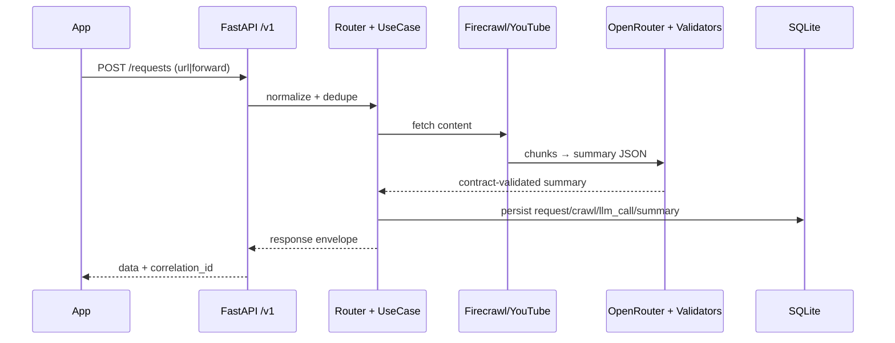
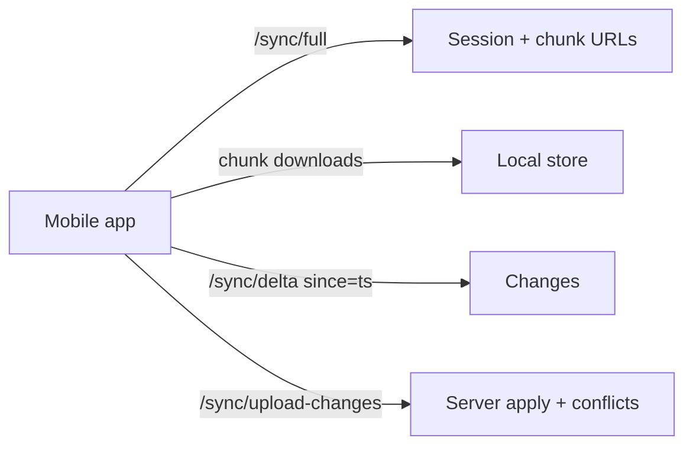

# Mobile API Specification (Bite-Size Reader)
- Version: 1.0
- Last Updated: 2026-02-04
- Scope: Telegram-first pipeline exposed via FastAPI `/v1` for Android/iOS clients.

## Contract at a Glance
- Envelopes only: `success=true|false`, `data` or `error`, always return `meta.timestamp`, `meta.version`, `correlation_id` header + body on errors.
- Auth: JWT (Telegram login exchange + refresh).
- Typed responses across auth, summaries, requests, search, sync, user. Errors standardized for 401/403/404/409/410/422/429/500.
- Base URLs: prod `https://bitsizereaderapi.po4yka.com/v1`, local `http://localhost:8000/v1`.

## Authentication
- `POST /auth/telegram-login`: exchange Telegram auth payload → `{access_token, refresh_token, expires_in}`.
- `POST /auth/refresh`: refresh access token.
- Header: `Authorization: Bearer <access_token>`.

## Core Resources (minimal fields)
- Summaries
  - `GET /summaries`: list with `pagination{total,limit,offset,has_more}` and `stats{total_summaries,unread_count}`.
  - `GET /summaries/{id}`: full JSON payload (matches `app/core/summary_contract.py`).
  - `PATCH /summaries/{id}`: `is_read` updates.
- Requests
  - `POST /requests`: `{type: url|forward, input_url|content_text, lang_preference}` with dedupe hint and `estimated_wait_seconds`.
  - `GET /requests/{id}`: request + crawl + llm_calls + summary ids.
  - `GET /requests/{id}/status`: polling with `stage`, `progress`, `estimated_seconds_remaining`.
  - `POST /requests/{id}/retry`: create a retry request.
- Search & Topics
  - `GET /search?q=...`: FTS results + pagination.
  - `GET /topics/trending`, `GET /topics/related`: trending tags and related summaries.
- URL Utility
  - `GET /urls/check-duplicate`: `is_duplicate`, `existing_request_id/summary_id`.
- Collections
  - `GET /collections`: list user collections.
  - `POST /collections`: create a collection.
  - `GET /collections/{id}`: collection detail with items.
  - `PATCH /collections/{id}`: update collection.
  - `DELETE /collections/{id}`: delete collection.
  - `POST /collections/{id}/items`: add item to collection.
  - `DELETE /collections/{id}/items/{item_id}`: remove item.
- Health
  - `GET /health`: service health check (returns 200 when API is ready).
- Notifications
  - Notification endpoints for push and in-app alerts.
- System
  - `GET /system/info`: system information and version.
- User
  - `GET /user/preferences`, `PATCH /user/preferences`.
  - `GET /user/stats`.

## Sync Model (mobile-first)
- `GET /sync/full`: session with chunk URLs; params `since`, `chunk_size<=500`.
- `GET /sync/full/{sync_id}/chunk/{n}`: chunked payloads (summaries+requests+sources).
- `GET /sync/delta?since=`: `changes{created,updated,deleted}`, `sync_timestamp`, `has_more`, `next_since`.
- `POST /sync/upload-changes`: client changes with conflict results (server wins by default).

## Data Shapes (summary)
- Envelopes: `success`, `data`, `meta{timestamp,version}`; errors add `error{code,message,details?,correlation_id}`.
- Summary payload fields align with `summary_contract.py`: `summary_250`, `summary_1000`, `tldr`, `key_ideas[5]`, `topic_tags[#tag]`, `entities{people,organizations,locations}`, `estimated_reading_time_min`, `key_stats`, `readability`, `metadata`, `extractive_quotes`, `questions_answered`, `topic_taxonomy`, `hallucination_risk`, `confidence`, optional `insights`, `forwarded_post_extras`.
- Processing stats: `model`, `tokens_used`, `latency_ms`, `crawl_latency_ms`, `llm_latency_ms`, `cost_usd`.
- Request status: `status`, `stage in [pending,content_extraction,llm_summarization,validation,success,error]`, `can_retry`, `estimated_seconds_remaining`.

## Error Handling
- Codes: `VALIDATION_ERROR`, `UNAUTHORIZED`, `FORBIDDEN`, `NOT_FOUND`, `DUPLICATE_URL`, `RATE_LIMIT_EXCEEDED`, `INTERNAL_ERROR`, `SERVICE_UNAVAILABLE`.
- Retry guidance: `429` respect `Retry-After`; `5xx` exponential backoff (2s,4s,8s,16s, max 4); `401/403` refresh auth; network errors same backoff.

## Rate Limiting (server guidance)
- Authenticated default: 100 rpm; summaries: 200 rpm; requests: 10 rpm; search: 50 rpm.
- Headers: `X-RateLimit-Limit`, `X-RateLimit-Remaining`, `X-RateLimit-Reset`; `429` includes `retry_after`.

## Offline & Mobile Notes
- Initial sync: `/sync/full` chunks → store locally (Room); mark timestamp.
- Delta loop: `/sync/delta` then `/sync/upload-changes`; server wins on conflicts unless client is whitelisted per TD.
- Queue offline writes (mark read) and flush when online.

## Security
- JWT HS256 secret >=32 chars; enforce `ALLOWED_USER_IDS`; validate Telegram login hash.
- Redact `Authorization` in logs; include `X-Correlation-ID`.
- HTTPS in prod; CORS restricted; body limits (<=10 MB).

## Testing Expectations
- API: pytest/httpx for envelopes, auth, summaries CRUD, requests + polling, search, sync, rate limiting, error envelopes.
- Mobile: MockWebServer + Room; ensure envelope parsing and conflict handling.
