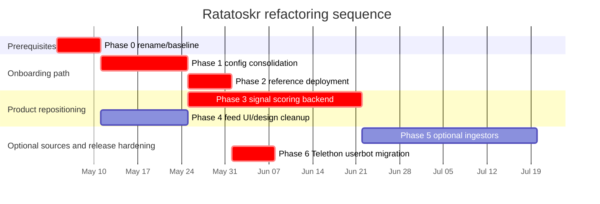

# Ratatoskr Refactoring Roadmap

Status: planning artifact for future work committed directly to `main`.
Scope: backend, web, CLI, browser extension, Docker/ops, and public documentation in this repository. The separate `ratatoskr-client` mobile repository is out of scope except where backend API contracts change.

## 1. Executive summary

Ratatoskr should move from a Telegram-first summarization bot toward a single-user, open-source, self-hosted information triage service. The execution order is: finish the rename cleanup and onboarding/config simplification first, make the reference Docker deployment reproducible second, then build proactive signal ingestion and scoring while the web UI is reshaped for a feed/topics surface. After that, add optional ingestors behind explicit cost/rate-limit contracts and migrate all Telegram adapters from PyroTGFork/Pyrogram to Telethon before public promotion.

The repository already moved farther than the original phase assumptions in some areas. Versioned migrations exist in two places, but the active runtime path is `app.cli.migrations`: `app/db/runtime/bootstrap.py` imports `app.cli.migrations.migration_runner`, `app/cli/migrate_db.py` delegates through `DatabaseSessionManager.migrate()`, and the observed running Raspberry Pi API container starts with `python -m app.cli.migrate_db`. Carbon runtime dependencies are gone from `clients/web/package.json`, but Carbon compatibility names and CSS classes remain in the in-repo design shim and auth client ID. Conversely, self-hosted Firecrawl is documented as compose-backed, but `ops/docker/docker-compose.yml` only points `FIRECRAWL_SELF_HOSTED_URL` at `firecrawl-api:host-gateway` and defines no Firecrawl service.

User-visible end state: a new self-hoster can clone, set only a small set of secrets, run one Docker Compose command, and get a first summary in under 10 minutes. A regular user can subscribe to feeds and see a ranked signal queue rather than only pushing one URL at a time. Power-user features remain available, but they stop dominating the default setup path.

## 2. Current state baseline

| Area | Current baseline | Evidence |
| --- | ---: | --- |
| Python source under `app/` | 761 Python files, 130,291 total lines by `find app -name '*.py' -print0 \| xargs -0 wc -l` | `app/` tree includes `adapters`, `application`, `domain`, `infrastructure`, `api`, `mcp`, `agents`, and `db` |
| App DB model count | 48 models in `ALL_MODELS` | `app/db/models.py` exports `ALL_MODELS`; `docs/reference/data-model.md` also states 48 model classes |
| Env vars in `.env.example` | 106 uncommented assignments | `.env.example` includes Telegram, scraper chain, OpenRouter, YouTube, Twitter/X, migration toggles, DB limits, streaming, MCP, and monitoring |
| Full documented config surface | 250+ variables | `docs/environment_variables.md` line 5 states `Total Variables: 250+`; `app/config/` has 25 config modules and 624 `Field(`/alias occurrences |
| Web UI footprint | 211 TS/TSX/CSS/JSON files, 31,204 TS/TSX/CSS LOC | `clients/web/` |
| Web dependencies | 4 runtime deps, 22 dev deps; no `@carbon/*` packages | `clients/web/package.json` |
| Carbon-specific surface | No Carbon package dependency, but 50 textual remnants in `clients/web` and `docs/reference/frontend-web.md` | `clients/web/src/design/` documents Carbon-compatible props; `clients/web/src/api/auth.ts` still uses `web-carbon-v1`; `clients/web/src/styles.css` still has `.cds--skeleton` compatibility |
| Client surfaces | Web SPA, CLI, browser extension | `clients/web`, `clients/cli`, `clients/browser-extension` |
| MCP surface | 22 tools, 16 resources | `app/mcp/tool_registrations.py` has 22 `@mcp.tool()` decorators; `app/mcp/resource_registrations.py` has 16 `@mcp.resource(...)` decorators |
| Scraper providers | `scrapling`, `defuddle`, `firecrawl`, `playwright`, `crawlee`, `direct_html` | `app/config/scraper.py` default provider order; implementations under `app/adapters/content/scraper/` |
| Existing ingestion | RSS models and polling/delivery, Telegram channel digest, Substack feed URL resolver | `app/db/_models_rss.py`, `app/adapters/rss/feed_poller.py`, `app/adapters/rss/rss_delivery_service.py`, `app/db/_models_digest.py`, `app/adapters/rss/substack.py` |
| Multi-agent system | 11 Python files, 3,995 LOC | `app/agents/`; active references from `app/application/services/multi_source_aggregation_service.py` |
| DB migrations | Versioned migration runners already exist, not Alembic; `app/cli/migrations/` is the active canonical path | `app/db/runtime/bootstrap.py` imports `app.cli.migrations.migration_runner`; `app/cli/migrate_db.py` is used by the running API startup command; `app/db/migrations/` appears to be duplicate drift |
| Test baseline | 337 test Python files; CI enforces coverage only on `tools/scripts/coverage_includes.txt` with `--fail-under=80` | `.github/workflows/ci.yml` unit coverage job; actual total coverage `[needs verification: run the CI coverage job or `pytest --cov=app`]` |
| Rename state | Functional rename is mostly done; historical and generated leftovers remain | `README.md` is Ratatoskr-first; `CHANGELOG.md` documents rename; `rg` still finds old name in generated `requirements-all.txt` comments, migration docs, examples named `BiteSizeClient`, `web-carbon-v1`, and `BSR*` alert names |
| Release packaging | Tag-triggered GHCR image publish exists, but no `:stable` tag | `.github/workflows/release.yml` publishes semver tags only |

Dependencies likely to be removed or replaced:

- `pyrotgfork` in `pyproject.toml` should be replaced by Telethon across all Telegram adapters, including the BotFather-token bot adapter in `app/adapters/telegram/telegram_client.py`.
- Carbon compatibility artifacts in `clients/web/src/design/`, `.cds--*` CSS, and `web-carbon-v1` auth/storage naming should be renamed away from IBM Carbon terms while keeping the current project-owned design shim.
- The optional `mcp` extra and `app/mcp/` should stay capable of read, write, and search operations for Hermes, but the contract should be intentionally scoped and documented.
- The `app/agents/` abstraction should be kept and adapted for signal scoring, refactoring where needed rather than deleting whole agent layers.
- `redis` and `chromadb` are first-class default compose dependencies. Chroma is required for signal scoring personalization.

## 3. Target state vision

Ratatoskr is a single-user triage backend that collects incoming information, ranks it against the owner’s interests, summarizes what is worth attention, and stores the result in SQLite with reproducible migrations. It is not a multi-tenant SaaS, not a general conversational agent platform, not the mobile client, and not a cost-oblivious scraper farm.

New Phase 3 domain model:

- `Source`: canonical origin such as RSS feed, HN front page, Reddit subreddit, Substack publication, Telegram channel, or manual URL.
- `Subscription`: single-owner configuration that enables a source with fetch cadence, topic constraints, and budget limits.
- `FeedItem`: one observed item from a source, normalized for dedupe and downstream scoring.
- `Topic`: explicit user interest or exclusion with embeddings and optional keyword/host constraints.
- `UserSignal`: scored recommendation event with pipeline evidence, final disposition, and feedback.

Existing nearby models should be merged into the generic model rather than left as permanent parallel concepts: `RSSFeed`/`RSSFeedSubscription`/`RSSFeedItem` in `app/db/_models_rss.py` and `Channel`/`ChannelSubscription`/`ChannelPost` in `app/db/_models_digest.py` become source-specific views or compatibility tables over `Source`/`Subscription`/`FeedItem`. `SummaryFeedback`, `UserGoal`, and aggregation identity helpers in `app/domain/models/source.py` should feed `Topic` and `UserSignal`.

Candidate top-of-README paragraph:

> Ratatoskr is a self-hosted, single-user information triage service. It watches the sources you choose, filters duplicates and low-signal items locally, uses an LLM only where it adds value, and turns the keepers into a searchable archive with Telegram, web, CLI, and browser-extension entrypoints.

## 4. Phase plans

### Phase 0 — Rename and baseline prerequisites

Goals:

- The repository no longer leaks old names in active runtime contracts, generated dependency comments, alerts, or example code except in explicit migration documentation.
- The maintainer can start Phase 1 from a known baseline: migration runner status, current env var inventory, and a passing docs-only CI check.
- The public docs agree on the actual deployment shape.

Concrete work breakdown:

| Unit | Files/modules | Change | Acceptance criterion |
| --- | --- | --- | --- |
| Rename residue audit | `requirements-all.txt`, `docs/tutorials/first-mobile-api-client.md`, `ops/monitoring/alerting_rules.yml`, `clients/web/src/api/auth.ts`, `clients/web/src/auth`, `docs/reference/frontend-web.md`, `docs/SPEC.md` | Classify each remaining `bite-size-reader`, `bsr`, `BSR`, and `web-carbon-v1` hit as historical, generated, or active. | `rg` output is only migration-history text plus generated comments that are regenerated or explicitly documented. |
| Docs truth reconciliation | `README.md`, `docs/DEPLOYMENT.md`, `docs/adr/0006-multi-provider-scraper-chain.md`, `ops/docker/docker-compose.yml` | Correct the mismatch where docs say compose includes self-hosted Firecrawl but compose does not. | A reader can tell whether Firecrawl is a built-in service, host-gateway dependency, or future Phase 2 work. |
| Migration status check | `app/cli/migrations/`, `app/db/migrations/`, `app/cli/migrate_db.py`, `app/db/runtime/bootstrap.py` | Keep `app/cli/migrations/` as canonical because the runtime imports it and the running API startup uses `python -m app.cli.migrate_db`; mark `app/db/migrations/` as duplicate drift to retire. | One canonical migration entrypoint is documented before adding Phase 3 tables. |

Decisions to surface before starting:

- Rename `web-carbon-v1` to `web-v1`; Carbon was removed and the remaining name should not remain an active contract. Include token/session invalidation notes or a one-release alias if needed.
- Should historical migration docs keep all `bsr` examples, or should they move into a collapsible legacy appendix?

Acceptance criteria:

- Phase 1 can begin with no active old-name contracts except explicitly accepted compatibility aliases.

Risks and mitigations:

- Rename cleanup breaks existing web/browser sessions. Mitigation: include a one-release alias window for client IDs and token storage keys.
- Generated lock comments reintroduce `bite-size-reader`. Mitigation: regenerate lockfiles from the renamed package metadata or document generated leftovers as non-runtime.

Estimated effort: low 1, expected 2, high 4 person-days.

Dependencies: none. Out of scope: mobile repo rename work, new branding/content strategy.

### Phase 1 — Config consolidation

Goals:

- A fresh self-hoster sees at most seven required env vars in `.env.example`.
- Optional knobs move behind code defaults and an optional `ratatoskr.yaml` power-user file.
- Startup validation explains missing required secrets with exact remediation.
- DB migration status is clear before schema-changing phases proceed.

Concrete work breakdown:

| Unit | Files/modules | Change | Acceptance criterion |
| --- | --- | --- | --- |
| Config inventory | `.env.example`, `docs/environment_variables.md`, `app/config/*.py` | Categorize every `.env.example` var as required, optional-defaulted, or deprecated/removable. | A table in docs lists all 106 `.env.example` vars and links to code defaults. |
| Minimal env example | `.env.example`, `README.md`, `docs/tutorials/quickstart.md` | Reduce `.env.example` to Telegram credentials, `ALLOWED_USER_IDS`, primary OpenRouter key, and any auth secret only when web/API/browser-extension auth is enabled. | Clone-to-first-summary path does not require editing scraper, YouTube, Twitter, migration, DB limit, streaming, MCP, or Grafana variables. |
| YAML config loader | `app/config/settings.py`, `app/config/models_file.py`, new `docs/reference/config-file.md` | Generalize the existing `config/models.yaml` loader into optional `ratatoskr.yaml` merged below env vars. | Tests prove precedence: code default < YAML < `.env` < process env. |
| Deprecation handling | `app/config/settings.py`, `app/config/scraper.py`, `tests/test_scraper_config.py`, new config tests | Emit actionable warnings/errors for moved or removed env vars. | Old scraper aliases and migration shadow vars have deterministic failure or warning behavior. |
| Migration prerequisite | `app/cli/migrate_db.py`, `app/cli/migrations/migration_runner.py`, migration runner docs | Make `app/cli/migrations/` the only authoritative migration directory; add status support to the public CLI if missing. | `python -m app.cli.migrate_db --status` or equivalent reports pending/applied migrations. |

Decisions to surface before starting:

- YAML library: recommendation is `ruamel.yaml` if the project wants comment-preserving `--config-print`; otherwise `PyYAML` is already in the dev group and is enough for one-way load.
- OpenRouter is the primary provider. Cloud Ollama or Ollama-compatible cloud endpoints are supported as an optional provider path, not the default.
- `JWT_SECRET_KEY` is required only when web/API/browser-extension auth is enabled.

Acceptance criteria:

- On a clean host, a user can copy the minimal env, fill required values, run the documented command, and receive a first Telegram summary in under 10 minutes, excluding account creation time.

Risks and mitigations:

- Moving env vars into YAML silently changes behavior. Mitigation: startup prints a redacted effective-config summary and warns on ignored env keys.
- Defaults in docs drift from code. Mitigation: generate config reference from Pydantic models in `app/config/`.

Estimated effort: low 5, expected 8, high 12 person-days.

Dependencies: Phase 0. Out of scope: changing scraper provider behavior, adding cloud Ollama support, adding Phase 3 tables.

### Phase 2 — Reference deployment as code

Goals:

- One compose command starts the default self-host stack with working internal dependencies.
- Self-hosted Firecrawl is the default scraper path; cloud Firecrawl is a fallback.
- Profiles separate core, Firecrawl, cloud Ollama/Ollama-compatible provider configuration, monitoring, and MCP costs.
- GHCR publishes semver and `stable` tags.

Concrete work breakdown:

| Unit | Files/modules | Change | Acceptance criterion |
| --- | --- | --- | --- |
| Compose profiles | `ops/docker/docker-compose.yml`, `ops/docker/docker-compose.monitoring.yml`, `README.md`, `docs/DEPLOYMENT.md` | Reshape services into `core`, `with-firecrawl`, `with-cloud-ollama`, `with-monitoring`, optional `mcp`. | `docker compose --profile with-firecrawl up` starts app/API/Redis/Chroma/Firecrawl without host-gateway assumptions; `with-cloud-ollama` documents env/YAML provider selection rather than starting a local model server. |
| Firecrawl service | `ops/docker/docker-compose.yml`, `app/config/scraper.py`, `docs/adr/0006-multi-provider-scraper-chain.md` | Add supported Firecrawl container/service and make self-hosted provider default in compose. | `SCRAPER_PROVIDER_ORDER` includes self-hosted Firecrawl and diagnostics show it enabled. |
| Cloud Ollama provider | `pyproject.toml`, `app/config/llm.py`, LLM adapter factory, compose docs | Add optional cloud Ollama/Ollama-compatible provider path with explicit quality and structured-output caveats. | First-summary smoke test passes with cloud Ollama provider config, while OpenRouter remains the documented primary path. |
| Release tags | `.github/workflows/release.yml`, docs | Add `:stable` tag promotion and rollback notes. | Tagging a release pushes `ghcr.io/po4yka/ratatoskr:<version>` and `:stable`. |
| Onboarding recording | `README.md`, `docs/assets/` | Add GIF/asciicast from clone to first summary. | README shows the exact happy path and measured elapsed time. |

Decisions to surface before starting:

- Default compose includes bot, API/web, Redis, and Chroma. The web UI is served by FastAPI, but API/web auth secrets are only required when that surface is enabled for browser/extension use.
- Redis and Chroma are core defaults, not optional profiles, because Chroma is required for signal scoring and Redis is already part of the operational stack.

Acceptance criteria:

- Fresh `docker compose up` or documented profile command on a clean host produces a running service that summarizes a test URL within 10 minutes including image pulls on a 50 Mbps connection.

Risks and mitigations:

- Firecrawl service increases RAM beyond small VPS/Raspberry Pi limits. Mitigation: provide `core-lite` path that uses Scrapling/Defuddle/direct HTML and labels Firecrawl as higher-quality profile.
- Cloud Ollama path disappoints users with weak structured JSON. Mitigation: document tested models/endpoints and keep OpenRouter as the primary quality path.

Estimated effort: low 4, expected 6, high 9 person-days.

Dependencies: Phase 1. Out of scope: Kubernetes, cloud Terraform, multi-node deployment.

### Phase 3 — Signal scoring v0

Goals:

- Ratatoskr can ingest continuously from configured sources and rank items before summarization.
- Telegram channel digest participates in signal scoring v0 as a first-class source type.
- Less than 10% of observed items reach the LLM-as-judge stage.
- Single-user personalization comes from config topics plus Chroma embeddings/feedback from stored items.
- Precision@5 is measured on a self-curated eval set over 2-3 weeks.

Concrete work breakdown:

| Unit | Files/modules | Change | Acceptance criterion |
| --- | --- | --- | --- |
| Domain/schema design | `app/domain/models/`, `app/db/_models_rss.py`, `app/db/_models_digest.py`, `app/db/_models_user_content.py`, new migration in `app/cli/migrations/` | Merge existing RSS and channel tables into generic `Source`, `Subscription`, and `FeedItem`; add `Topic` and `UserSignal` with source-specific compatibility fields/views where needed. | Migration creates/updates tables, preserves existing RSS/channel data, and has rollback/backup notes. |
| Ingestion worker | `app/adapters/rss/`, `app/adapters/digest/`, `app/infrastructure/scheduler/`, `app/di/scheduler.py`, API routers for RSS/digest | Build continuous worker with per-source cadence, backoff, and Telegram channel digest as a first-class v0 source. | Broken feed/channel cannot loop hot; fetch errors trip a circuit breaker after N consecutive failures. |
| Cheap filter pipeline | new `app/application/services/signal_scoring.py`, `app/infrastructure/search/`, Chroma/embedding services | Implement recency, engagement, MinHash dedupe, source diversity, Chroma topic similarity, and budget gates. | Test fixture shows at least 90% of sample candidates rejected before LLM stage; scoring fails closed if Chroma is unavailable. |
| LLM judge | LLM adapter layer, prompts in `app/prompts/en/` and `app/prompts/ru/` if present, summary contract tests | Add bounded judge prompt for top candidates only. | Cost logs show judge calls only for top candidate slice and all prompts exist in both languages if current prompt structure requires it. |
| Feedback/eval loop | `SummaryFeedback`, new eval fixtures under `tests/fixtures/`, CLI/API endpoint | Record like/dislike/skip and compute precision@5. | Maintainer can run one command to score a 2-3 week eval set. |
| Agent adaptation | `app/agents/`, `app/application/services/multi_source_aggregation_service.py`, `docs/multi_agent_architecture.md` | Keep and adapt existing agents for signal workflows; refactor boundaries where agents need deterministic pre-filter inputs or scoring evidence. | Signal scoring uses the agent layer where it adds orchestration/validation value without forcing cheap heuristic filters through LLM-style abstractions. |
| MCP/Hermes contract | `app/mcp/`, `docs/mcp_server.md` | Preserve read/write/search capabilities for Hermes while documenting a minimal stable contract. | MCP tool/resource set is intentionally versioned and covers read, write, and search operations needed by Hermes. |

Decisions to surface before starting:

- Manual one-off URL submissions should be mirrored into `Source`/`FeedItem` where needed for unified feedback, while preserving `Request`/`Summary` as the existing submission/result record.
- Telegram channel digest is a first-class source in signal scoring v0.
- Chroma is required for signal scoring; the implementation should document startup/degraded behavior explicitly rather than silently falling back to SQLite-only scoring.

Acceptance criteria:

- With 5-10 configured sources including at least one Telegram channel digest source, Ratatoskr produces a daily ranked top-5 queue, stores the filter evidence per item, keeps LLM judge calls under 10% of observed items, requires Chroma for topic similarity, and reports precision@5 on the eval set.

Risks and mitigations:

- Continuous ingester loops on permanently broken feeds and wastes CPU/network. Mitigation: exponential backoff, max consecutive failure circuit breaker, and per-source health status.
- Dedupe misses near-identical syndication. Mitigation: store canonical URL, normalized title hash, and MinHash signature before summary.
- LLM costs creep upward as sources grow. Mitigation: per-day judge budget and hard pre-LLM candidate cap.

Estimated effort: low 15, expected 22, high 30 person-days.

Dependencies: Phase 1; backend can start before Phase 4 UI but cannot ship user-facing feed UI before Phase 4 decisions. Out of scope: X/Twitter ingestion, multi-user recommendation ML, SaaS analytics.

### Phase 4 — Finish Carbon rename and lighten the project design shim

Goals:

- The feed/topics UI introduced by Phase 3 has a lightweight reader-app design system.
- Carbon compatibility names disappear from active code now that IBM Carbon has been removed.
- Design tokens have one source usable by web and future mobile theme overrides.

Current correction: Carbon package dependencies are already removed. `clients/web/package.json` has no `@carbon/*`, and docs describe a project-owned design shim under `clients/web/src/design/`. Phase 4 should be a lighter cleanup of the current project-owned design shim, not a literal Tailwind + shadcn/ui rewrite.

Concrete work breakdown:

| Unit | Files/modules | Change | Acceptance criterion |
| --- | --- | --- | --- |
| Design shim cleanup | `clients/web/src/design/`, `clients/web/src/styles.css`, `docs/reference/frontend-web.md` | Keep the project-owned design shim, remove IBM Carbon naming from comments/types/classes, and document the shim as Ratatoskr design primitives. | Feature code continues importing from `clients/web/src/design/` and no active symbol names refer to Carbon. |
| Token source | new `clients/web/tokens/` or repo-level `design/tokens.json`, `clients/web/src/design/tokens.css` | Define color, spacing, radius, typography once with generated CSS output. | Generated CSS matches current light/dark themes and produces a mobile-consumable JSON artifact. |
| Compatibility cleanup | `clients/web/src/design/**`, `clients/web/src/api/auth.ts`, tests | Remove `.cds--*`, Carbon prop comments, `CarbonTagType`, and `web-carbon-v1` where safe. | `rg -n 'Carbon|carbon|cds-|web-carbon-v1' clients/web docs/reference/frontend-web.md` is empty or contains only compatibility docs. |
| Feed/topics UI | `clients/web/src/features/`, `clients/web/src/routes/manifest.tsx`, generated API types | Add Phase 3 surfaces: ranked queue, source health, topic preferences, feedback actions. | User can triage top signals from `/web` without Telegram. |
| Static checks | `clients/web` | Run static and unit checks. | `npm run check:static && npm run test` pass. |

Decisions to surface before starting:

- Keep the current project-owned design shim and perform a lighter cleanup/rename. Do not migrate literally to Tailwind + shadcn/ui in this roadmap.
- Should browser extension UI share tokens now, or wait until after web feed UI stabilizes?

Acceptance criteria:

- Web has no unintentional Carbon-specific runtime/contract names, has a feed/topics UX ready for Phase 3, and passes static checks.

Risks and mitigations:

- UI cleanup consumes Phase 3 bandwidth. Mitigation: backend Phase 3 ships APIs first; UI work stays route-scoped to feed/topics plus compatibility cleanup.
- Token generation adds tooling without payoff. Mitigation: start with one JSON token file and one generator script, not a full design pipeline.

Estimated effort: low 6, expected 10, high 14 person-days.

Dependencies: Phase 0 for client ID rename decision; can run parallel with Phase 3. Out of scope: mobile UI implementation, marketing landing page.

### Phase 5 — X / Reddit / HN / Substack ingestors

Goals:

- Ingester modules are pluggable and disabled by default except generic RSS.
- Zero-cost paths for HN, Reddit free tier, and Substack RSS are documented.
- X/Twitter ingestion is explicit opt-in with cost warning and bring-your-own-token setup.

Concrete work breakdown:

| Unit | Files/modules | Change | Acceptance criterion |
| --- | --- | --- | --- |
| Ingester contract | `app/application/ports/`, `app/adapters/rss/`, new `app/adapters/ingestors/` | Define lifecycle, rate-limit, auth, dedupe, and error semantics. | RSS/Substack adapter implements the same contract as later HN/Reddit/X. |
| HN adapter | new `app/adapters/ingestors/hn.py`, config, tests | Poll HN API/front page with no auth. | HN source produces normalized `FeedItem`s with engagement metadata. |
| Reddit adapter | new `app/adapters/ingestors/reddit.py`, config docs | Implement free-tier polling with 100 req/min limit controls. | Adapter respects per-source and global rate budgets. |
| Substack adapter | `app/adapters/rss/substack.py`, RSS adapter | Treat Substack as RSS specialization, not a bespoke scraper. | Substack publication URL resolves and ingests through generic RSS path. |
| X/Twitter adapter | `app/config/twitter.py`, `app/adapters/twitter/`, docs | Add opt-in source using existing extraction where possible; document Basic tier cost. | Disabled by default; startup warns if enabled without credentials/budget. |

Decisions to surface before starting:

- Do Reddit OAuth credentials belong in env-required docs or YAML-only optional config?
- Should X/Twitter ingestion be allowed in the same worker as RSS/HN, or isolated due to cost and account-risk semantics?

Acceptance criteria:

- A default install ingests RSS/Substack with no paid API; enabling HN/Reddit requires documented config only; enabling X/Twitter requires an explicit cost acknowledgment.

Risks and mitigations:

- Source APIs rate-limit or ban noisy polling. Mitigation: ETag/If-Modified-Since where available, minimum polling intervals, and source-specific backoff.
- X/Twitter costs surprise users. Mitigation: require `TWITTER_INGESTION_ACK_COST=true` or equivalent before startup enables it.

Estimated effort: low 12, expected 18, high 26 person-days.

Dependencies: Phase 3 contract. Out of scope: Instagram/Threads ingestion, paid hosted proxies, browser automation for every source.

### Phase 6 — Pyrogram to Telethon migration

Goals:

- Userbot/digest session handling migrates from PyroTGFork/Pyrogram to Telethon.
- The BotFather-token bot adapter also migrates to Telethon, so all Telegram runtime code uses one actively maintained client stack.
- Existing self-hosters get an explicit session migration path before public v1.

Concrete work breakdown:

| Unit | Files/modules | Change | Acceptance criterion |
| --- | --- | --- | --- |
| Usage audit | `app/adapters/digest/`, `app/adapters/telegram/`, `app/bootstrap/telegram_runtime.py`, `docs/reference/cli-commands.md` | Inventory all Pyrogram/PyroTGFork imports and behavior, including bot-token runtime, raw draft streaming, command routing, topic manager, and userbot session init. | Migration scope lists exact classes/functions affected and identifies any Telethon API gaps. |
| Telethon runtime adapters | `app/adapters/telegram/telegram_client.py`, `app/adapters/telegram/telegram_bot.py`, `app/adapters/telegram/draft_stream_sender.py`, command handlers, digest userbot client | Implement Telethon-backed bot and userbot adapters behind narrow internal protocols. | Bot commands, callbacks, forwarded posts, URL submissions, draft/status updates, `/init_session`, digest fetch, and channel metadata tests pass against mocked Telethon. |
| Session migration | docs/how-to, CLI helper | Provide conversion or re-auth path from Pyrogram session files. | Upgrade guide tells users exactly how to migrate without data loss. |
| Dependency update | `pyproject.toml`, lockfiles, docs | Add Telethon and remove `pyrotgfork`/Pyrogram-specific dependency assumptions after all Telegram code migrates. | Dependency graph has one Telegram client stack and docs no longer point to Pyrogram for active runtime APIs. |

Decisions to surface before starting:

- Migrate all Telegram code, including the BotFather-token bot adapter, to Telethon.
- Reuse existing session names or require new Telethon session files?

Acceptance criteria:

- Telegram bot and channel digest/userbot functionality work without Pyrogram/PyroTGFork runtime dependency, public docs mention Telethon, and upgrade notes are in `CHANGELOG.md`.

Risks and mitigations:

- Telegram auth/session migration breaks channel digest for existing users. Mitigation: ship a preflight checker and keep old session files untouched until new auth succeeds.
- Bot adapter migration changes message/callback semantics. Mitigation: introduce small bot and userbot protocols first, then run characterization tests around command dispatch, callback handling, forwarded posts, albums, and draft/status updates.

Estimated effort: low 7, expected 10, high 15 person-days.

Dependencies: Phase 0 rename docs; before public v1. Out of scope: changing Telegram command UX or adding new Telegram features.

## 5. Sequencing

Critical path: Phase 0 → Phase 1 → Phase 2, plus Phase 3 before the repositioning is real and Phase 6 before v1 promotion. Phase 4 can run parallel with Phase 3 after Phase 0. Phase 5 depends on Phase 3’s source/ingester contract and should not block the first public self-hostable v1 unless X/Reddit/HN/Substack are promoted as launch features.

## 6. Public-release readiness checklist

- GHCR publishes `ghcr.io/po4yka/ratatoskr:<semver>` and `ghcr.io/po4yka/ratatoskr:stable`.
- README quickstart is tested by at least one external person on a clean machine.
- `.env.example` has seven or fewer required entries and no advanced tuning defaults.
- `ratatoskr.yaml` schema and precedence are documented.
- `docker compose up` or the chosen default profile reaches first summary in under 10 minutes.
- Self-hosted Firecrawl compose behavior matches README and deployment docs.
- OpenRouter primary and cloud Ollama/Ollama-compatible optional provider paths have honest quality/cost notes.
- Versioned DB migration status/backup/restore flow is documented and tested against an older sample DB.
- `CHANGELOG.md` documents migration path from each prior public version, including rename and Telethon session changes.
- Backup and restore docs cover SQLite, Chroma data, Redis cache expectations, downloaded videos, and config files.
- Pyrogram/PyroTGFork → Telethon migration is complete for all Telegram adapters, including the BotFather-token bot adapter and userbot/digest path.
- MCP read/write/search contract for Hermes is intentionally documented with security model, auth mode, and stable URI/tool set.
- Multi-agent system adaptation plan is complete; agent layers used by signal scoring are refactored where needed.
- Web frontend has no unintentional Carbon runtime dependencies or active Carbon-named contracts.
- Browser extension and CLI docs match current auth/client ID contracts.
- Mobile API contract changes caused by Phase 3 are reflected in `docs/openapi/mobile_api.yaml/json` and `docs/MOBILE_API_SPEC.md`.
- CI passes: Python lint/type/tests, web `npm run check:static && npm run test`, Docker build, OpenAPI sync, and coverage threshold.

## 7. Out of scope for this entire roadmap

- Multi-tenant or SaaS architecture.
- Hermes Agent integration; this roadmap only preserves the read/write/search MCP contract Hermes will need later.
- Obsidian integration.
- Mobile client implementation in the separate `ratatoskr-client` repo.
- New positioning campaign beyond the README paragraph and signal scoring v0.
- Full social-network scraping beyond the optional ingestors in Phase 5.
- Rewriting the application away from SQLite/Peewee during this roadmap.

## 8. Open questions

1. Which cloud Ollama/Ollama-compatible provider endpoint(s) should be tested and documented as supported?
2. When `JWT_SECRET_KEY` is required for web/API/browser-extension auth, should Ratatoskr generate a first-run secret automatically for local-only installs or fail until the user sets one?
3. For `web-carbon-v1` to `web-v1`, should there be a one-release compatibility alias, or is immediate session reset acceptable before public v1?
4. While merging RSS/channel tables into `Source`/`Subscription`, should old table names remain as compatibility views for one release?
5. What exact Chroma availability behavior should signal scoring use at startup: fail the worker, fail the whole app, or run one-off summarization while disabling signal scoring?
6. Which current agent responsibilities should own signal scoring stages: existing `MultiSourceExtractionAgent`/`MultiSourceAggregationAgent`, new signal-specific agents, or a hybrid?
7. Which MCP writes are required for Hermes v0: create aggregation bundle only, source/subscription management, feedback actions, or all three?
8. Should the default compose stack expose Chroma/Redis health in the web admin UI before Phase 3 ships?
9. Should Telethon migration preserve current draft streaming behavior exactly, or is a simpler status-message fallback acceptable if Telethon raw API coverage differs?
