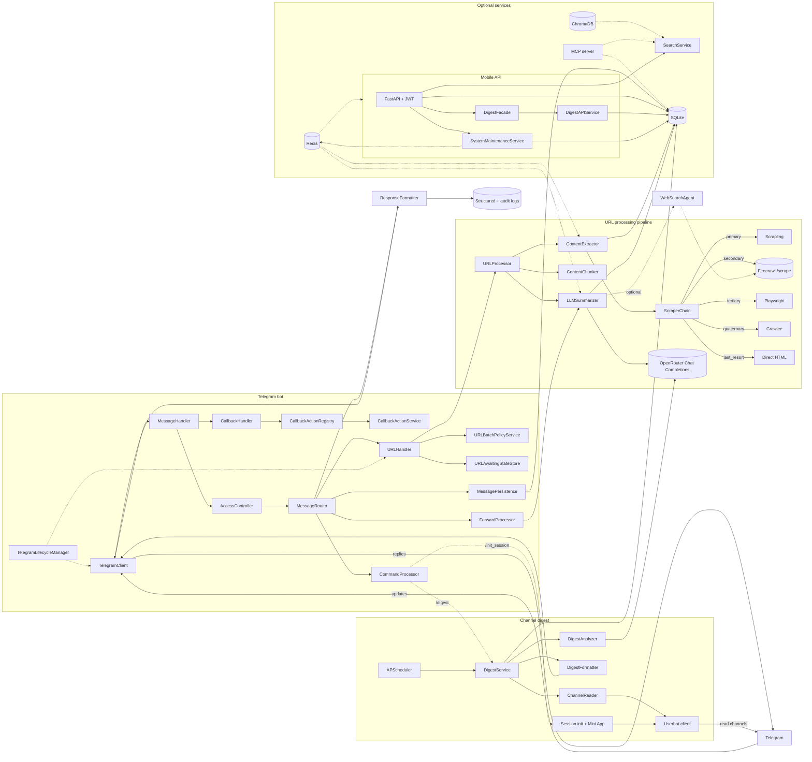

# Architecture Overview

A bird's-eye view of how Ratatoskr is wired together: the major
subsystems, how a Telegram update becomes a stored summary, and where
to find the canonical doc for every piece. Reach for this page when
you're either evaluating the system or trying to find the right code
to read first.

**Audience:** Operators evaluating Ratatoskr, contributors orienting
themselves, integrators planning how to attach.
**Type:** Explanation.
**Related:** [`docs/SPEC.md`](../SPEC.md) (canonical contract),
[`docs/HEXAGONAL_ARCHITECTURE_QUICKSTART.md`](../HEXAGONAL_ARCHITECTURE_QUICKSTART.md)
(layer rationale), [`docs/multi_agent_architecture.md`](../multi_agent_architecture.md)
(LLM agent internals), [`docs/explanation/observability-strategy.md`](observability-strategy.md)
(metrics, traces, logs).

---

## Component diagram



The bot ingests updates via a lightweight `TelegramClient`, normalizes
them through `MessageHandler`, and hands them to `MessageRouter` /
`CallbackHandler`. `CallbackHandler` delegates action execution through
`CallbackActionRegistry` + `CallbackActionService`; `URLHandler` delegates
batch / await-state concerns through `URLBatchPolicyService` +
`URLAwaitingStateStore` before invoking `URLProcessor`.
`TelegramLifecycleManager` owns startup / shutdown of background tasks
and warmups. The channel-digest subsystem uses a separate
`UserbotClient` (authenticated as a real Telegram user) to read channel
histories, analyzes posts via LLM, and delivers formatted digests on a
schedule or via `/digest`.

For the mobile API, routers are transport-focused and delegate
infrastructure orchestration to dedicated services (`DigestFacade`,
`SystemMaintenanceService`) rather than performing DB / Redis / file
operations inline. `ResponseFormatter` centralizes Telegram replies and
audit logging while all artifacts land in SQLite.

---

## Layered view

The codebase follows a hexagonal (ports-and-adapters) layout. Each
layer has a narrow job; cross-layer references go through ports, not
direct imports. See
[HEXAGONAL_ARCHITECTURE_QUICKSTART.md](../HEXAGONAL_ARCHITECTURE_QUICKSTART.md)
for the rationale.

| Layer | Path | Role |
| --- | --- | --- |
| Adapters | `app/adapters/` | Talk to the outside world: Telegram, scrapers, OpenRouter, YouTube, Twitter, ElevenLabs. No business logic; translate I/O to / from domain DTOs. |
| Domain | `app/domain/` | DDD entities, value objects, and pure-Python domain services. No I/O. |
| Application | `app/application/` | Use cases, DTOs, application services that orchestrate domain logic and adapter ports. |
| Infrastructure | `app/infrastructure/` | Concrete persistence (SQLite), event bus, cache (Redis), HTTP clients, vector store, embedding factories. |
| Core | `app/core/` | Cross-cutting utilities: URL normalisation, JSON parsing / repair, summary-contract validation, structured logging. |
| Database | `app/db/` | Peewee ORM models and `DatabaseSessionManager` (the sole DB entry point). 48 model classes registered in `ALL_MODELS` (`app/db/models.py`). |
| DI | `app/di/` | Runtime composition only — concrete dependency graphs are not assembled outside this package. |

---

## Request lifecycle: a Telegram URL becomes a stored summary

```
Telegram update
  └─ TelegramClient (raw event)
     └─ MessageHandler (normalize, persist snapshot)
        └─ AccessController (ALLOWED_USER_IDS gate)
           └─ MessageRouter
              └─ URLHandler ── URLBatchPolicyService / URLAwaitingStateStore
                 └─ URLProcessor (correlation_id assigned)
                    ├─ ContentExtractor → ScraperChain (Scrapling → Firecrawl → Playwright → Crawlee → direct HTML)
                    ├─ ContentChunker (large bodies)
                    └─ LLMSummarizer
                       └─ OpenRouter (with retries; web-search enrichment optional)
                          └─ Summary JSON (validated against summary_contract.py)
                             ├─ SQLite: summaries / llm_calls / requests / crawl_results
                             └─ ResponseFormatter → TelegramClient → Telegram reply
```

Every step writes to SQLite (full request, all crawl attempts, every
LLM call, the final summary) and stamps the correlation ID into
structured logs so a single ID lets you trace from the Telegram message
to the OpenRouter response and back.

---

## Subsystem index

Each subsystem has a canonical doc; this page is the entry point.

| Subsystem | Purpose | Canonical doc |
| --- | --- | --- |
| URL pipeline (Scrapling, Firecrawl, Playwright, Crawlee, direct HTML) | Extract clean article content from arbitrary URLs with a fallback chain. | [`docs/SPEC.md`](../SPEC.md) (`Content extraction` section) |
| YouTube extractor | Download video (1080p), pull transcripts, store metadata. | [`docs/how-to/configure-youtube-download.md`](../how-to/configure-youtube-download.md) |
| Twitter / X extractor | Public Firecrawl scrape with optional Playwright fallback for tweets, threads, and X Articles. | [`docs/how-to/configure-twitter-extraction.md`](../how-to/configure-twitter-extraction.md) |
| LLM summarization (multi-agent) | Extraction → summarization → validation → optional web search, with self-correction. | [`docs/multi_agent_architecture.md`](../multi_agent_architecture.md) |
| Web search enrichment | Inject up-to-date context via Firecrawl Search before final summary. | [`docs/how-to/enable-web-search.md`](../how-to/enable-web-search.md) |
| Channel digest | Userbot reads subscribed channels; scheduled digests via `/digest`. | [`docs/SPEC.md`](../SPEC.md) (`Channel digest` section) |
| Mixed-source aggregation | Bundle one or more links + forwards / attachments into a single synthesised result. | [`docs/SPEC.md`](../SPEC.md) (`Mixed-source aggregation` section) |
| Search (FTS5 + vector) | Local full-text plus optional ChromaDB semantic / hybrid search. | [`docs/how-to/setup-chroma-vector-search.md`](../how-to/setup-chroma-vector-search.md) |
| Mobile API | FastAPI + JWT, sync v2, ratelimit, summary CRUD, aggregations. | [`docs/MOBILE_API_SPEC.md`](../MOBILE_API_SPEC.md) |
| Web frontend | React SPA served on `/web/*`; library, search, submit, collections, digest, preferences, admin. Uses a project-owned design shim under `clients/web/src/design/`. | [`docs/reference/frontend-web.md`](../reference/frontend-web.md) |
| MCP server | Model Context Protocol server: 22 tools and 16 resources for external AI agents (OpenClaw, Claude Desktop). | [`docs/mcp_server.md`](../mcp_server.md) |
| Observability | Prometheus metrics, structured logs, correlation-ID tracing, Loki / Promtail / Grafana stack. | [`docs/explanation/observability-strategy.md`](observability-strategy.md) |
| Redis (optional) | Response cache, rate-limit store, sync session locks, distributed background-task locks. | [`docs/how-to/setup-redis-caching.md`](../how-to/setup-redis-caching.md) |
| ElevenLabs TTS (optional) | Generate audio from a stored summary on demand. | `app/adapters/elevenlabs/` (no standalone doc yet) |

---

## Where to next

- New here and want to run the bot? → [Quickstart Tutorial](../tutorials/quickstart.md).
- Deploying to a server? → [DEPLOYMENT.md](../DEPLOYMENT.md).
- Modifying the codebase? → [`CLAUDE.md`](../../CLAUDE.md) for the
  AI-friendly engineer's tour, then [`docs/SPEC.md`](../SPEC.md) for
  the canonical contract.
- Curious about layer choices? → [HEXAGONAL_ARCHITECTURE_QUICKSTART.md](../HEXAGONAL_ARCHITECTURE_QUICKSTART.md).
- Tracking down a specific request? → start with the correlation ID in
  the user-visible error message, then read
  [`docs/explanation/observability-strategy.md`](observability-strategy.md).
