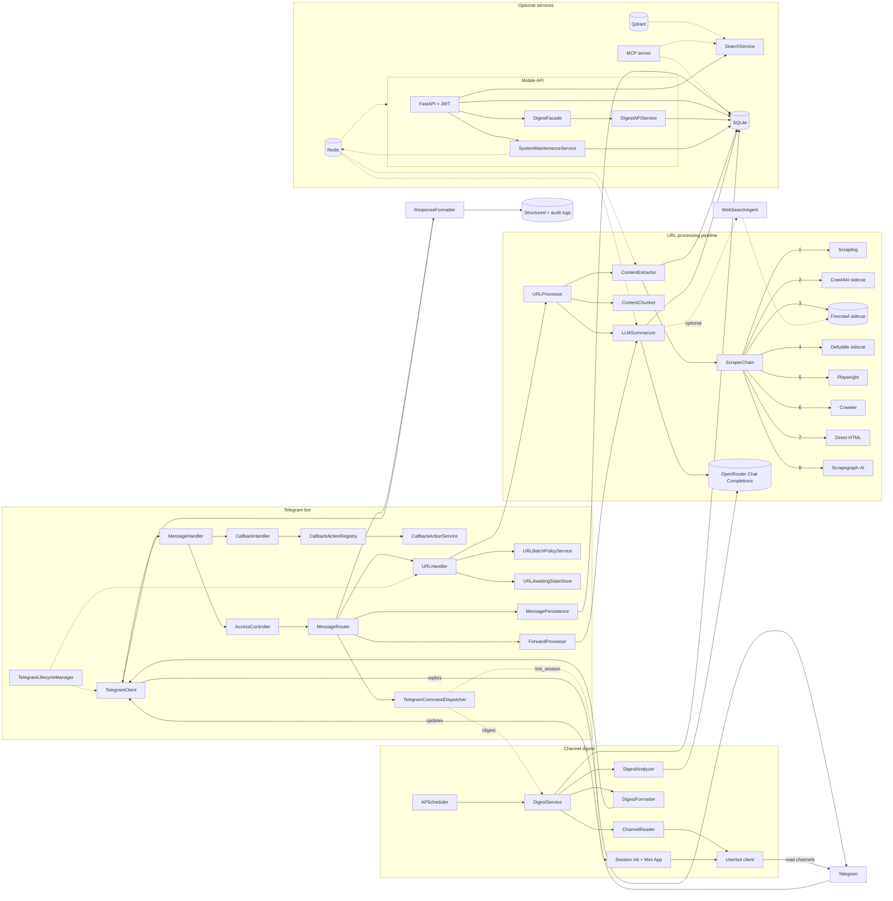
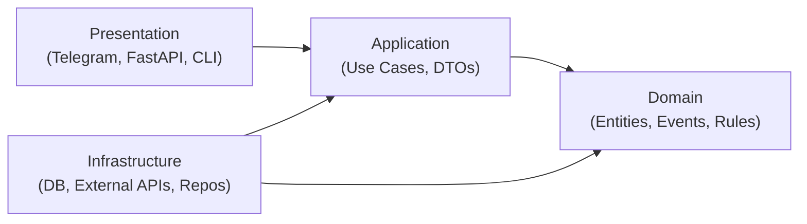
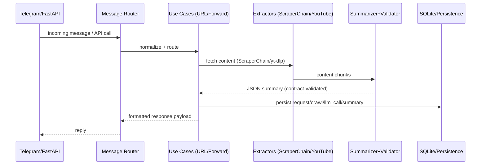

# Architecture Overview

A bird's-eye view of how Ratatoskr is wired together: the major
subsystems, how a Telegram update becomes a stored summary, and where
to find the canonical doc for every piece. Reach for this page when
you're either evaluating the system or trying to find the right code
to read first.

**Audience:** Operators evaluating Ratatoskr, contributors orienting
themselves, integrators planning how to attach.
**Type:** Explanation.
**Related:** [`docs/SPEC.md`](../SPEC.md) (canonical contract),
[`#layering-quick-reference`](#layering-quick-reference)
(layer rationale), [`docs/explanation/multi-agent-architecture.md`](multi-agent-architecture.md)
(LLM agent internals), [`docs/explanation/observability-strategy.md`](observability-strategy.md)
(metrics, traces, logs).

---

## Goals and Non-Goals

**Goals:**

- Robust URL → content → LLM → JSON summary pipeline.
- End-to-end data capture: Telegram request, full scraper-chain output, raw LLM response, final JSON summary.
- Deterministic Summary JSON contract with validation (length caps, types, dedupe).
- Idempotence for URLs (normalized URL hash).
- Clear observability (structured logs, audit trail, latency and token metrics).
- Single-user security hardening (allowlist).

**Non-Goals:**

- Multi-tenant access control.
- Long-term vector search, RAG, or analytics dashboards (future work).
- Real-time streaming summaries.

---

## User and Access Control

- **Telegram bot access** is allowlist-first via `ALLOWED_USER_IDS` (comma-separated); group/supergroup chats and unauthorized DMs are rejected generically.
- **JWT API and hosted MCP auth** are allowlist-aware but intentionally fail-open when `ALLOWED_USER_IDS` is empty, which enables explicit multi-user external deployments.
- **Client-level external access** can be constrained independently via `ALLOWED_CLIENT_IDS`, secret-login provisioning rules, and rollout stages.
- All secrets pass via env vars or hashed secret storage; no plaintext secrets in DB or logs.

---

## Component diagram



The bot ingests updates via a lightweight `TelegramClient`, normalizes
them through `MessageHandler`, and hands them to `MessageRouter` /
`CallbackHandler`. `CallbackHandler` delegates action execution through
`CallbackActionRegistry` + `CallbackActionService`; `URLHandler` delegates
batch / await-state concerns through `URLBatchPolicyService` +
`URLAwaitingStateStore` before invoking `URLProcessor`.
`TelegramLifecycleManager` owns startup / shutdown of background tasks
and warmups. The channel-digest subsystem uses a separate
`UserbotClient` (authenticated as a real Telegram user) to read channel
histories, analyzes posts via LLM, and delivers formatted digests on a
schedule or via `/digest`.

For the mobile API, routers are transport-focused and delegate
infrastructure orchestration to dedicated services (`DigestFacade`,
`SystemMaintenanceService`) rather than performing DB / Redis / file
operations inline. `ResponseFormatter` centralizes Telegram replies and
audit logging while all artifacts land in SQLite.

---

## Layered view

The codebase follows a hexagonal (ports-and-adapters) layout. Each
layer has a narrow job; cross-layer references go through ports, not
direct imports. See
[#layering-quick-reference](#layering-quick-reference)
for the rationale.

| Layer | Path | Role |
| --- | --- | --- |
| Adapters | `app/adapters/` | Talk to the outside world: Telegram, scrapers, OpenRouter, YouTube, Twitter, ElevenLabs. No business logic; translate I/O to / from domain DTOs. |
| Domain | `app/domain/` | DDD entities, value objects, and pure-Python domain services. No I/O. |
| Application | `app/application/` | Use cases, DTOs, application services that orchestrate domain logic and adapter ports. |
| Infrastructure | `app/infrastructure/` | Concrete persistence (SQLite), event bus, cache (Redis), HTTP clients, vector store, embedding factories. |
| Core | `app/core/` | Cross-cutting utilities: URL normalisation, JSON parsing / repair, summary-contract validation, structured logging. |
| Database | `app/db/` | Peewee ORM models and `DatabaseSessionManager` (the sole DB entry point). 48 model classes registered in `ALL_MODELS` (`app/db/models.py`). |
| DI | `app/di/` | Runtime composition only — concrete dependency graphs are not assembled outside this package. |

---

## Request lifecycle: a Telegram URL becomes a stored summary

```
Telegram update
  └─ TelegramClient (raw event)
     └─ MessageHandler (normalize, persist snapshot)
        └─ AccessController (ALLOWED_USER_IDS gate)
           └─ MessageRouter
              └─ URLHandler ── URLBatchPolicyService / URLAwaitingStateStore
                 └─ URLProcessor (correlation_id assigned)
                    ├─ ContentExtractor → ScraperChain (Scrapling → Crawl4AI → Firecrawl self-hosted → Defuddle → Playwright → Crawlee → direct HTML → ScrapeGraphAI)
                    │   (see docs/explanation/scraper-chain.md for the detailed provider diagram)
                    ├─ ContentChunker (large bodies)
                    └─ LLMSummarizer
                       └─ OpenRouter (with retries; web-search enrichment optional)
                          └─ Summary JSON (validated against summary_contract.py)
                             ├─ SQLite: summaries / llm_calls / requests / crawl_results
                             └─ ResponseFormatter → TelegramClient → Telegram reply
```

Every step writes to SQLite (full request, all crawl attempts, every
LLM call, the final summary) and stamps the correlation ID into
structured logs so a single ID lets you trace from the Telegram message
to the OpenRouter response and back.

---

## Subsystem index

Each subsystem has a canonical doc; this page is the entry point.

| Subsystem | Purpose | Canonical doc |
| --- | --- | --- |
| URL pipeline (Scrapling, Crawl4AI, Firecrawl self-hosted, Defuddle, Playwright, Crawlee, direct HTML, ScrapeGraphAI) | Extract clean article content from arbitrary URLs with an 8-provider fallback chain. Order overridable via `SCRAPER_PROVIDER_ORDER`. Cloud Firecrawl not used. | [`docs/explanation/scraper-chain.md`](scraper-chain.md) · [`docs/SPEC.md`](../SPEC.md) |
| YouTube extractor | Download video (1080p), pull transcripts, store metadata. | [`docs/guides/configure-youtube-download.md`](../guides/configure-youtube-download.md) |
| Twitter / X extractor | Two-tier extraction: self-hosted Firecrawl scrape by default; opt-in authenticated Playwright for protected accounts, threads, and X Articles. | [`docs/guides/configure-twitter-extraction.md`](../guides/configure-twitter-extraction.md) |
| LLM summarization (multi-agent) | Extraction → summarization → validation → optional web search, with self-correction. | [`docs/explanation/multi-agent-architecture.md`](multi-agent-architecture.md) |
| Web search enrichment | Inject up-to-date context via self-hosted Firecrawl search (`FIRECRAWL_SELF_HOSTED_ENABLED=true`) before final summary. | [`docs/guides/enable-web-search.md`](../guides/enable-web-search.md) |
| Channel digest | Userbot reads subscribed channels; scheduled digests via `/digest`. | [`docs/SPEC.md`](../SPEC.md) (`Channel digest` section) |
| Mixed-source aggregation | Bundle one or more links + forwards / attachments into a single synthesised result. | [`docs/SPEC.md`](../SPEC.md) (`Mixed-source aggregation` section) |
| Search (FTS5 + vector) | Local full-text plus optional Qdrant semantic / hybrid search. | [`docs/guides/setup-qdrant-vector-search.md`](../guides/setup-qdrant-vector-search.md) |
| Mobile API | FastAPI + JWT, sync v2, ratelimit, summary CRUD, aggregations. | [`docs/reference/mobile-api.md`](../reference/mobile-api.md) |
| Web frontend | React SPA served on `/web/*`; library, search, submit, collections, digest, preferences, admin. Uses a project-owned design shim under `clients/web/src/design/`. | [`docs/reference/frontend-web.md`](../reference/frontend-web.md) |
| MCP server | Model Context Protocol server: 22 tools and 16 resources for external AI agents (OpenClaw, Claude Desktop). | [`docs/reference/mcp-server.md`](../reference/mcp-server.md) |
| Observability | Prometheus metrics, structured logs, correlation-ID tracing, Loki / Promtail / Grafana stack. | [`docs/explanation/observability-strategy.md`](observability-strategy.md) |
| Redis (optional) | Response cache, rate-limit store, sync session locks, distributed background-task locks. | [`docs/guides/setup-redis-caching.md`](../guides/setup-redis-caching.md) |
| ElevenLabs TTS (optional) | Generate audio from a stored summary on demand. | `app/adapters/elevenlabs/` (no standalone doc yet) |

---

## Where to next

- New here and want to run the bot? → [Quickstart Tutorial](../guides/quickstart.md).
- Deploying to a server? → [guides/deploy-production.md](../guides/deploy-production.md).
- Modifying the codebase? → [`CLAUDE.md`](../../CLAUDE.md) for the
  AI-friendly engineer's tour, then [`docs/SPEC.md`](../SPEC.md) for
  the canonical contract.
- Curious about layer choices? → [Layering quick reference](#layering-quick-reference).
- Tracking down a specific request? → start with the correlation ID in
  the user-visible error message, then read
  [`docs/explanation/observability-strategy.md`](observability-strategy.md).

---

## Layering quick reference

> The content below was previously in `HEXAGONAL_ARCHITECTURE_QUICKSTART.md`.

This doc keeps our layering consistent across Telegram, CLI, and the mobile API. Keep dependencies pointing inward: Domain has no outward dependencies.

## Runtime policy

- DI container is always enabled in runtime entrypoints (Telegram bot and CLI harness).
- Presentation handlers call application use cases for business workflows.
- No presentation-layer fallback path should call repositories directly for the same workflow.
- FastAPI routers remain transport-only: orchestration belongs in dedicated application/service classes.
- Adapter seams should depend on protocol contracts, not concrete `*Impl` classes, at constructor/public boundaries.

## Layer Map (project-specific)

- Presentation: `app/adapters/telegram/*`, `app/api/*`, CLI in `app/cli/*`
- Application: `app/application/use_cases/*`, DTOs in `app/application/dto/*`
- Domain: `app/domain/*` (models, events, services, exceptions)
- Infrastructure: `app/infrastructure/*`, `app/db/*`, external clients in `app/adapters/*`
- DI: `app/di/` (split by concern: `api.py`, `application.py`, `telegram.py`, `repositories.py`, `shared.py`)

## DB Layer

- `DatabaseSessionManager` (`app/db/session.py`) is the sole database entry point. It handles connection management, migrations, FTS5 indexing, and async operations via `AsyncRWLock`.
- New business workflows should go through application use cases and repository ports in `app/infrastructure/persistence/sqlite/repositories/*`, not through the session manager directly.

## Current seam examples (2026-03)

- `app/api/routers/digest.py` → delegates orchestration to `DigestFacade`.
- `app/api/routers/system.py` → delegates DB/Redis/file maintenance work to `SystemMaintenanceService`.
- Telegram callback flow delegates action execution through `CallbackActionRegistry` + `CallbackActionService`.
- Telegram URL flow delegates security/timeout/batch/state policy through `URLBatchPolicyService` + `URLAwaitingStateStore`.
- Formatting stack constructor seams use protocol interfaces from `app/adapters/external/formatting/protocols.py` (for example `ResponseSender`, `DataFormatter`, `TextProcessor`) instead of concrete implementation types.



## Core flow we run every day



## Quickstart: add a new use case

1) Domain: add/adjust entities or domain services in `app/domain/*` (no external deps).
2) Application: create a use case in `app/application/use_cases/` that orchestrates domain + repositories.
3) Infrastructure: ensure repository/client implementations exist in `app/infrastructure/*` or `app/adapters/*`.
4) DI: wire it in the appropriate `app/di/` module (e.g., `application.py` for use cases, `repositories.py` for repos).
5) Presentation: call the use case from Telegram handlers (`app/adapters/telegram/*`) or FastAPI (`app/api/*`), formatting responses via `app/adapters/external/response_formatter.py`.

## When to add a use case

- Any distinct workflow (e.g., mark summary read, search summaries, sync mobile).
- Reads: use query objects; writes: use command objects.

## Testing hints

- Unit: pure domain rules and use cases with mocked repositories.
- Integration: run via container wiring against test DB; validate persistence and contracts.
