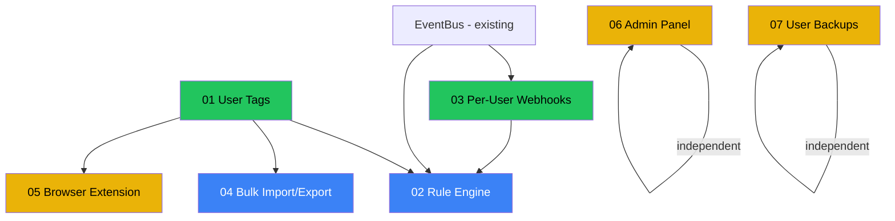

# Phasing and Priorities

This document defines the build order, dependencies, effort estimates, and success criteria for adapting Karakeep features into BSR.

## Priority Matrix

```
                    User Value
                 Low    Medium    High
           +--------+---------+--------+
    Small  | Backups| Webhooks|        |
           +--------+---------+--------+
Effort     |        | Admin   | Tags   |
   Medium  |        | Browser | Import |
           +--------+---------+--------+
    Large  |        |         | Rules  |
           +--------+---------+--------+
```

## Dependency Graph



Legend: Green = Phase 1, Blue = Phase 2, Yellow = Phase 3

## Phased Build Order

### Phase 1: Foundation

Build first -- other features depend on these.

| # | Feature | Spec | Effort | Rationale |
|---|---------|------|--------|-----------|
| 1 | User Tags | [01-user-tags.md](01-user-tags.md) | ~5 days | Foundation for rules, import, extension. Highest standalone value. |
| 2 | Per-User Webhooks | [03-per-user-webhooks.md](03-per-user-webhooks.md) | ~3 days | Enables external integrations. Foundation for rule engine actions. Extends existing webhook handler. |

**Phase 1 deliverables:**

- Tag CRUD API + DB migration + backfill from `topic_tags`
- Tag management web page
- Telegram `/tag` and `/tags` commands
- Webhook subscription CRUD API + HMAC delivery
- Webhook management web page
- Updated search (FTS5 + ChromaDB) with tag filtering

**Phase 1 total: ~8 days**

---

### Phase 2: Automation + Data Portability

Build after Phase 1. These features use tags and webhooks.

| # | Feature | Spec | Effort | Rationale |
|---|---------|------|--------|-----------|
| 3 | Rule Engine | [02-rule-engine.md](02-rule-engine.md) | ~8 days | Depends on tags (add_tag action) + webhooks (send_webhook action) + EventBus. Highest complexity. |
| 4 | Bulk Import/Export | [04-bulk-import-export.md](04-bulk-import-export.md) | ~5 days | Depends on tags (imported tags create Tag records). High value for migration from other tools. |

**Phase 2 deliverables:**

- Rule engine with condition evaluation + action execution
- Rule CRUD API + web rule builder
- Execution logging and history
- Import parsers (Netscape HTML, Pocket, Omnivore, Linkwarden, CSV)
- Import job tracking with progress
- Export in JSON, CSV, HTML formats
- Telegram file-based import/export

**Phase 2 total: ~13 days**

---

### Phase 3: Reach + Operations

Independent features. Build in any order after Phase 1.

| # | Feature | Spec | Effort | Rationale |
|---|---------|------|--------|-----------|
| 5 | Browser Extension | [05-browser-extension.md](05-browser-extension.md) | ~5 days | Depends on quick-save API + tags. New entry point for content. |
| 6 | Enhanced Admin Panel | [06-admin-panel.md](06-admin-panel.md) | ~5 days | Independent. Operational visibility. |
| 7 | User Backups | [07-user-backups.md](07-user-backups.md) | ~3 days | Independent. Data safety net. |

**Phase 3 deliverables:**

- Chrome + Firefox extension with one-click save
- Admin dashboard with users, jobs, health, metrics, audit log tabs
- User-initiated backups with download/restore
- Backup scheduling with retention policy

**Phase 3 total: ~13 days**

---

## Total Effort Estimate

| Phase | Duration | Cumulative |
|-------|----------|------------|
| Phase 1 | ~8 days | 8 days |
| Phase 2 | ~13 days | 21 days |
| Phase 3 | ~13 days | 34 days |

Estimates assume a single developer working full-time. Phases 2 and 3 can partially overlap (admin panel and backups can start during Phase 2).

## Risk Register

| Risk | Impact | Mitigation |
|------|--------|------------|
| Tag backfill migration corrupts existing `topic_tags` | High | Run migration in transaction; keep `topic_tags` in JSON untouched (additive, not replacement) |
| Rule engine creates infinite loops | High | Loop detection via `processing_rule_ids` set; max 100 executions/min/user |
| Import parser fails on edge-case export formats | Medium | Start with Netscape HTML (most standard); add formats incrementally |
| Browser extension review delays (Chrome Web Store) | Medium | Support sideloading for self-hosted users; submit early |
| Large backups consume disk space | Low | Retention policy; warn on >500MB; consider compression level tuning |
| Webhook endpoints receive PII | Medium | Document that webhook payloads contain summary data; HMAC signing for authenticity |

## Success Criteria

### Phase 1

- [ ] User can create, rename, merge, and delete tags via API and web UI
- [ ] User can attach/detach tags from summaries (manual and AI-generated)
- [ ] `/tag` Telegram command works when replying to a summary
- [ ] Search results can be filtered by tag name
- [ ] FTS5 index includes user tags
- [ ] User can create webhook subscriptions with event filtering
- [ ] Webhook deliveries are signed with HMAC-SHA256
- [ ] Failed deliveries retry with exponential backoff
- [ ] Delivery history is viewable in web UI

### Phase 2

- [ ] User can create rules with event/condition/action definitions
- [ ] Rules fire automatically when matching events occur
- [ ] Rule execution is logged with pass/fail details
- [ ] `/rules` Telegram command lists active rules
- [ ] Dry-run endpoint returns expected results without side effects
- [ ] Import supports at least 3 formats (Netscape HTML, Pocket, generic CSV)
- [ ] Import deduplicates by URL hash
- [ ] Import creates Tag records from imported tags
- [ ] Export produces valid JSON, CSV, and HTML files
- [ ] Telegram accepts file attachments for import

### Phase 3

- [ ] Browser extension saves current page to BSR with one click
- [ ] Extension supports tag assignment from popup
- [ ] Extension works in both Chrome and Firefox
- [ ] Admin panel shows user list with per-user stats
- [ ] Admin panel shows background job status
- [ ] Admin panel shows content health (failed requests breakdown)
- [ ] User can trigger manual backup and download ZIP
- [ ] Backup restore recovers summaries, tags, collections, highlights
- [ ] Scheduled backups run according to user preferences

## What to Build Next (Beyond Phase 3)

These are not in scope for the Karakeep adaptation but are natural next steps:

- **Smart collections** -- query-based auto-collections (like Karakeep's smart lists)
- **Public sharing** -- share individual summaries or collections via public URL
- **Standalone CLI** -- distributable CLI tool (like Karakeep's `@karakeep/cli`)
- **OPML import/export** -- for RSS/channel digest subscriptions
- **Reading time goals** -- extend existing goal system with tag/collection-scoped goals
