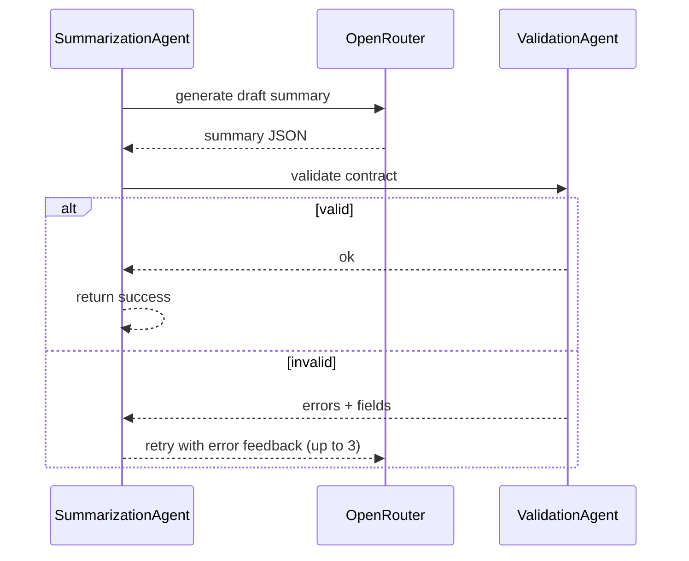

# Multi-Agent Architecture

Agents wrap extraction, summarization, and validation with structured results, retries, and observability.

## Roles
- **ContentExtractionAgent** — Firecrawl/YouTube fetch; persists crawl artifacts.
- **SummarizationAgent** — OpenRouter call with self-correction loop; tracks tokens/cost/latency.
- **ValidationAgent** — Enforces `summary_contract` (length caps, deduped tags/entities).
- **AgentOrchestrator** — Coordinates extract → summarize → validate and returns final JSON.
- All inherit `BaseAgent[TInput, TOutput]` with `success`, `output`, `error`, `metadata`.

```mermaid
flowchart LR
  In[Input (url|forward)] --> Extract["ContentExtractionAgent\n(Firecrawl/YouTube)"]
  Extract --> Summ["SummarizationAgent\n(OpenRouter + feedback)"]
  Summ --> Valid["ValidationAgent\n(summary_contract)"]
  Valid --> Out[Summary JSON + telemetry]
```

## Feedback loop (summarization)


## Usage
- Extraction:
```python
agent = ContentExtractionAgent(content_extractor, correlation_id="abc123")
result = await agent.execute(ExtractionInput(url="https://example.com", correlation_id="abc123"))
```
- Full pipeline:
```python
orchestrator = AgentOrchestrator(extraction_agent, summarization_agent)
result = await orchestrator.execute(OrchestratorInput(url="https://example.com", correlation_id="abc123"))
```
`result.output` carries validated summary JSON; `metadata` tracks attempts, latencies, tokens, cost.

## Integration
- Used in `app/application/use_cases/summarize_url.py` and by the API background processor.
- Wraps `ContentExtractor`/`LLMSummarizer`, adds retries, validation, and correlation-aware logging.

## Testing
- Unit: mock Firecrawl/LLM; assert retries and validation errors are surfaced.
- Integration: orchestrator with fixtures; expect `validation_attempts > 1` when schema errors injected.

## Files
- `app/agents/base_agent.py`
- `app/agents/content_extraction_agent.py`
- `app/agents/summarization_agent.py`
- `app/agents/validation_agent.py`
- `app/agents/orchestrator.py`
