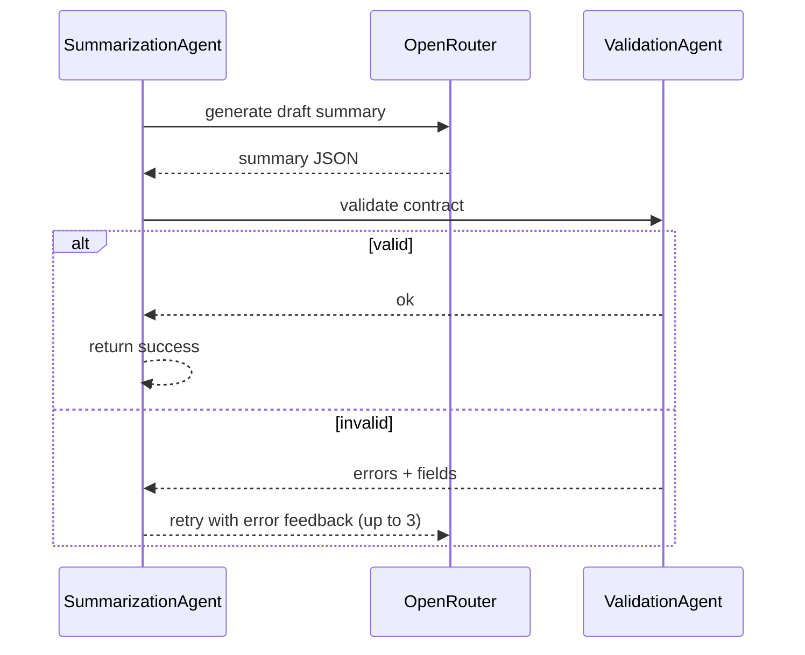
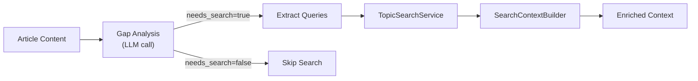

# Multi-Agent Architecture

Agents wrap extraction, summarization, and validation with structured results, retries, and observability.

## Roles
- **ContentExtractionAgent** — Firecrawl/YouTube fetch; persists crawl artifacts.
- **SummarizationAgent** — OpenRouter call with self-correction loop; tracks tokens/cost/latency.
- **ValidationAgent** — Enforces `summary_contract` (length caps, deduped tags/entities).
- **WebSearchAgent** — Analyzes content for knowledge gaps; executes targeted web searches to enrich context.
- **AgentOrchestrator** — Coordinates extract → summarize → validate and returns final JSON.
- **SingleAgentOrchestrator** — Lightweight wrapper for executing a single agent with standardized logging and error handling.
- All inherit `BaseAgent[TInput, TOutput]` with `success`, `output`, `error`, `metadata`.

```mermaid
flowchart LR
  In[Input (url|forward)] --> Extract["ContentExtractionAgent\n(Firecrawl/YouTube)"]
  Extract --> WebSearch["WebSearchAgent\n(optional enrichment)"]
  WebSearch --> Summ["SummarizationAgent\n(OpenRouter + feedback)"]
  Summ --> Valid["ValidationAgent\n(summary_contract)"]
  Valid --> Out[Summary JSON + telemetry]
```

## Feedback loop (summarization)


## Usage
- Extraction:
```python
agent = ContentExtractionAgent(content_extractor, correlation_id="abc123")
result = await agent.execute(ExtractionInput(url="https://example.com", correlation_id="abc123"))
```
- Full pipeline:
```python
orchestrator = AgentOrchestrator(extraction_agent, summarization_agent)
result = await orchestrator.execute(OrchestratorInput(url="https://example.com", correlation_id="abc123"))
```
`result.output` carries validated summary JSON; `metadata` tracks attempts, latencies, tokens, cost.

## Integration
- Used in `app/application/use_cases/summarize_url.py` and by the API background processor.
- Wraps `ContentExtractor`/`LLMSummarizer`, adds retries, validation, and correlation-aware logging.

## Testing
- Unit: mock Firecrawl/LLM; assert retries and validation errors are surfaced.
- Integration: orchestrator with fixtures; expect `validation_attempts > 1` when schema errors injected.

## WebSearchAgent (optional enrichment)

When `WEB_SEARCH_ENABLED=true`, WebSearchAgent enriches content with current web context:



### Input/Output
```python
class WebSearchAgentInput(BaseModel):
    content: str           # Article content to analyze
    language: str = "en"   # Target language
    correlation_id: str | None = None

class WebSearchAgentOutput(BaseModel):
    searched: bool         # Whether search was executed
    context: str           # Formatted search context (empty if not searched)
    queries_executed: list[str]  # Actual queries run
    articles_found: int    # Number of search results
    reason: str            # Explanation (why search needed/skipped)
```

### Usage
```python
from app.agents.web_search_agent import WebSearchAgent, WebSearchAgentInput

agent = WebSearchAgent(
    llm_client=openrouter,
    search_service=topic_search,
    cfg=web_search_config,
    correlation_id="abc123",
)

result = await agent.execute(WebSearchAgentInput(
    content=article_content,
    language="en",
))

if result.success and result.output.context:
    # Inject context into summarization prompt
    enriched_prompt = f"{original_prompt}\n\n{result.output.context}"
```

### Integration
- Integrated into `LLMSummarizer._maybe_enrich_with_search()`
- Called before main summarization when enabled
- Uses `SearchContextBuilder` to format results as markdown
- Gracefully handles failures (continues without enrichment)

## Files
- `app/agents/base_agent.py`
- `app/agents/content_extraction_agent.py`
- `app/agents/summarization_agent.py`
- `app/agents/validation_agent.py`
- `app/agents/web_search_agent.py`
- `app/agents/orchestrator.py`
- `app/adapters/content/search_context_builder.py`
- `app/prompts/search_analysis_en.txt`
- `app/prompts/search_analysis_ru.txt`
